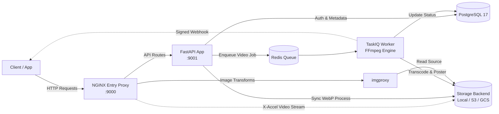

<br>
<p align="center">
  <a href="#">
    
  </a>

  <h3 align="center">Filemanager-FastAPI</h3>

  <p align="center">
    Blazing fast media microservice using FastAPI.
  </p>
</p>

<p align="center">
  <a href="https://github.com/JexPY/filemanager-fastapi/actions/workflows/ci.yml"></a>
  <a href="https://github.com/JexPY/filemanager-fastapi/actions/workflows/codeql.yml"></a>
  <a href="https://sonarcloud.io/summary/new_code?id=JexPY_filemanager-fastapi"></a>
  <a href="https://sonarcloud.io/summary/new_code?id=JexPY_filemanager-fastapi"></a>
  <a href="https://snyk.io/test/github/JexPY/filemanager-fastapi"></a>
  <a href="https://opensource.org/licenses/MIT"></a>
</p>

---

A media-processing microservice built with FastAPI. Upload images and videos, get back
optimized WebP thumbnails via imgproxy and async H.264/AAC-compressed MP4s. Also generates
QR codes. Storage is pluggable — local disk, S3/R2/MinIO, or Google Cloud Storage.

> The API self-documents interactively at `/docs` (Swagger UI) and `/redoc` (ReDoc). Architectural deep dives and deployment guidelines are available in [`docs/PRODUCTION.md`](docs/PRODUCTION.md).

---

## A note on v1

This project started as a handwritten side project — no LLM assistance, just raw curiosity and
a need for a file management microservice that actually did what I wanted. That original version
lives on the [`before_llm`](https://github.com/JexPY/filemanager-fastapi/tree/before_llm)
branch as a snapshot of where it all began: Pillow-SIMD, libcloud, a rougher but honest
codebase. Worth a look if you're curious about the evolution.

The current version is a full rewrite with a hardened architecture, async-first internals, and
a production-grade feature set — but the spirit is the same.

---

## Architecture



### How It Works

1. **Ingress Layer (NGINX on `:9000`)**
   - Single public entry point for all API and media traffic.
   - Enforces burst-safe rate limiting on upload endpoints.
   - Streams local video directly via zero-copy `X-Accel-Redirect` without loading bytes through the Python application.
   - Protects `imgproxy` with cache locks to prevent duplicate image rendering.

2. **API Control Plane (FastAPI on `:9001`)**
   - **Authentication**: Supports static master bearer tokens and scoped HS256 capability JWTs (`upload:image`, `upload:video`).
   - **Image Pipeline**: Validates dimensions, strips EXIF/GPS/ICC metadata, and encodes to WebP in-memory using `libvips`.
   - **QR Generator**: Generates PNG QR codes with optional logo overlays (Wi-Fi, vCard, MeCard, Geo, EPC, plain text/URL) via `segno` + `pyvips`.
   - **State Management**: Tracks asset ownership, SHA-256 idempotency hashes, and access visibility (`public` / `private`) in PostgreSQL.

3. **Async Processing Plane (TaskIQ + FFmpeg)**
   - Consumes background video transcoding tasks from Redis.
   - Compresses video to H.264/AAC MP4 with optional duration trimming and optimization presets.
   - Automatically extracts poster preview frames and saves them as linked image records.
   - Dispatches HMAC-SHA256 signed event notifications to `callback_url` with SSRF protection.

4. **Storage & Serving Tier**
   - Pluggable storage adapters: Local disk, Amazon S3, Cloudflare R2, MinIO, or Google Cloud Storage.
   - On-demand image resizing, cropping, and formatting via signed `imgproxy` URLs.

---

## Quickstart

```sh
cp .env-example .env
# Fill in IMGPROXY_KEY, IMGPROXY_SALT, and FILE_MANAGER_BEARER_TOKENS at minimum.
# See .env-example for all options.

docker compose up --build
```

The API is available at `http://localhost:9000`. Swagger UI at `http://localhost:9000/docs`.

```sh
TOKEN=your-token-here

# Upload an image
curl -H "Authorization: Bearer $TOKEN" -F "file=@photo.jpg" \
  http://localhost:9000/upload/image

# Upload a video (async — returns a task_id)
curl -H "Authorization: Bearer $TOKEN" -F "file=@clip.mp4" \
  http://localhost:9000/upload/video

# Poll the task
curl -H "Authorization: Bearer $TOKEN" http://localhost:9000/tasks/<task_id>

# Generate a plain text / URL QR code
curl -H "Authorization: Bearer $TOKEN" -F "content=https://example.com" \
  http://localhost:9000/generate/qrcode -o qr.png

# Generate a Wi-Fi QR code with logo
curl -H "Authorization: Bearer $TOKEN" -F "ssid=MyHomeWiFi" -F "password=secret" \
  -F "logo=@logo.png" http://localhost:9000/generate/qrcode/wifi -o wifi_qr.png

# Generate a vCard contact QR code
curl -H "Authorization: Bearer $TOKEN" -F "name=Doe;John" -F "phone=+1234567890" \
  http://localhost:9000/generate/qrcode/vcard -o vcard_qr.png

# List your uploads
curl -H "Authorization: Bearer $TOKEN" http://localhost:9000/files
```

---

## Development

Everything runs inside Docker — no local Python environment needed.

```sh
# Full stack
docker compose up --build

# Run tests
docker compose run --rm test pytest -v

# Lint + format + type-check
docker compose run --rm test ruff check .
docker compose run --rm test ruff format .
docker compose run --rm test mypy app
```

---

## License

MIT — see [`LICENSE.txt`](LICENSE.txt).

---

*PRs welcome. If something is broken or confusing, open an issue.*
