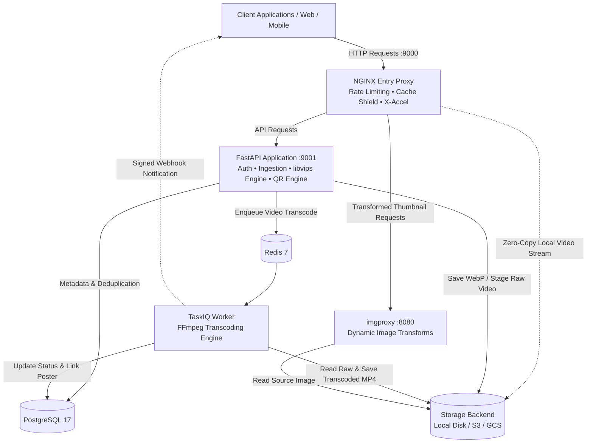
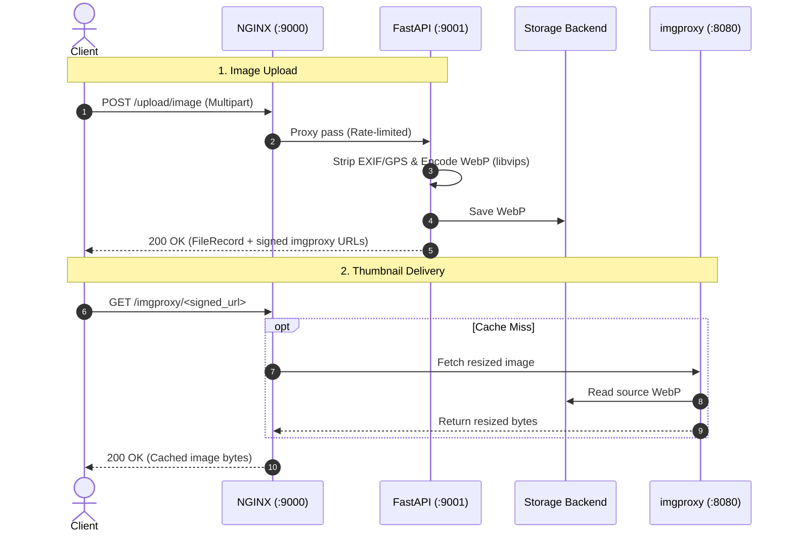
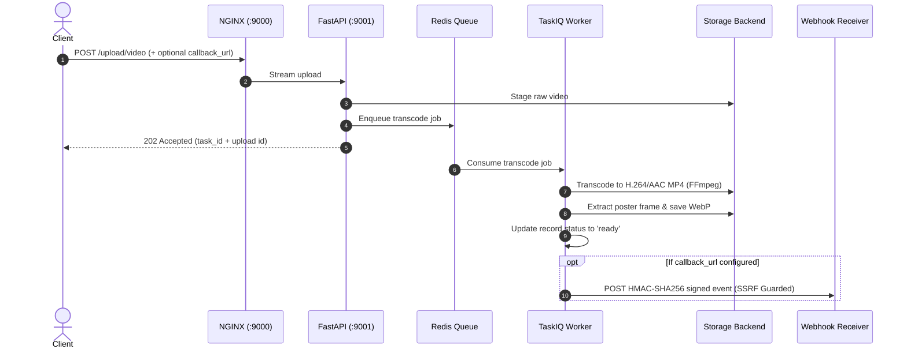
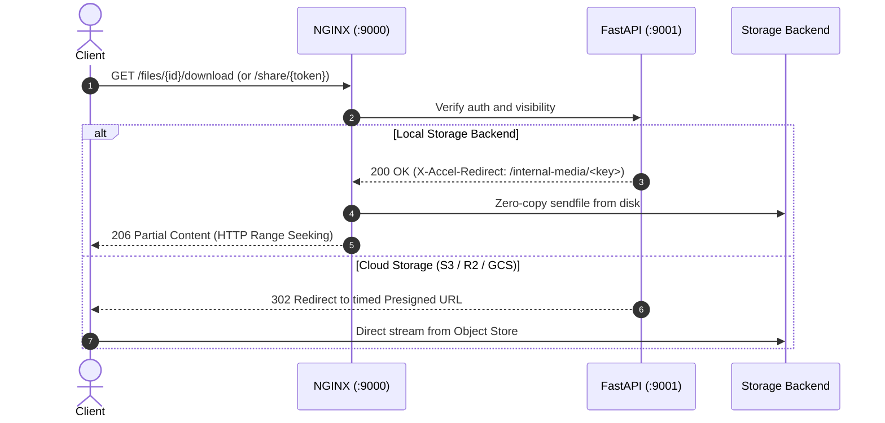

<br>
<p align="center">
  <a href="#">
    
  </a>

  <h3 align="center">Filemanager-FastAPI</h3>

  <p align="center">
    Blazing fast media microservice using FastAPI.
  </p>
</p>

<p align="center">
  <a href="https://github.com/JexPY/filemanager-fastapi/actions/workflows/ci.yml"></a>
  <a href="https://github.com/JexPY/filemanager-fastapi/actions/workflows/codeql.yml"></a>
  <a href="https://sonarcloud.io/summary/new_code?id=JexPY_filemanager-fastapi"></a>
  <a href="https://sonarcloud.io/summary/new_code?id=JexPY_filemanager-fastapi"></a>
  <a href="https://snyk.io/test/github/JexPY/filemanager-fastapi"></a>
  <a href="https://opensource.org/licenses/MIT"></a>
</p>

---

A media-processing microservice built with FastAPI. Upload images and videos, get back
optimized WebP thumbnails via imgproxy and async H.264/AAC-compressed MP4s. Also generates
QR codes. Storage is pluggable — local disk, S3/R2/MinIO, or Google Cloud Storage.

> The API self-documents interactively at `/docs` (Swagger UI) and `/redoc` (ReDoc). Architectural deep dives and deployment guidelines are available in [`docs/PRODUCTION.md`](docs/PRODUCTION.md).

---

## A note on v1

This project started as a handwritten side project — no LLM assistance, just raw curiosity and
a need for a file management microservice that actually did what I wanted. That original version
lives on the [`before_llm`](https://github.com/JexPY/filemanager-fastapi/tree/before_llm)
branch as a snapshot of where it all began: Pillow-SIMD, libcloud, a rougher but honest
codebase. Worth a look if you're curious about the evolution.

The current version is a full rewrite with a hardened architecture, async-first internals, and
a production-grade feature set — but the spirit is the same.

---

## Architecture & System Design

Filemanager-FastAPI is architected as an **Origin Shield** and **Distributed Worker** system designed for high throughput, bounded memory consumption, and zero-copy media streaming.

### Container Topology



---

### Core Processing Workflows

#### 1. Image Ingestion & Thumbnail Delivery
Images are processed synchronously in-memory: metadata (EXIF, GPS, ICC profiles) is stripped, the image is re-encoded to WebP using `libvips`, and stored. The client receives signed `imgproxy` URLs for on-demand resizing and caching.



#### 2. Asynchronous Video Transcoding & Webhooks
Video uploads stream directly to a disk buffer, stage to storage, and enqueue an asynchronous compression job. The background worker compresses video to H.264/AAC MP4, extracts poster preview frames, updates the database, and fires signed webhooks.



#### 3. Zero-Copy Playback & Streaming
Videos can be streamed directly with full HTTP Range seeking support. For local disk storage, NGINX handles playback directly via `X-Accel-Redirect` without touching Python runtime memory. For cloud storage (S3/GCS), clients are redirected to secure timed presigned URLs.



---

### Endpoint Directory

| Category | Method | Endpoint | Auth Required | Description |
|---|---|---|---|---|
| **Uploads** | `POST` | `/upload/image` | `upload:image` scope / Master | Synchronous image ingestion: metadata strip + WebP encode. |
| | `POST` | `/upload/images` | `upload:image` scope / Master | Bulk image ingestion (concurrency limited to 4). |
| | `POST` | `/upload/video` | `upload:video` scope / Master | Async video upload: disk stream staging + transcode task enqueue. |
| **Tasks** | `GET` | `/tasks/{task_id}` | Bearer Token | Poll status of asynchronous video compression job. |
| **Files** | `GET` | `/files` | Bearer Token | Paginated file listing with type, status, and visibility filters. |
| | `GET` | `/files/{id}` | Bearer Token | Fetch metadata record for specific upload (owner-scoped). |
| | `DELETE` | `/files/{id}` | Bearer Token | Delete upload from storage and database. |
| | `PATCH` | `/files/{id}/visibility` | Bearer Token | Toggle video visibility (`public` vs `private`). |
| **Playback** | `GET` | `/files/{id}/download` | Bearer / Public | Video playback with HTTP Range seeking (X-Accel / Presigned 302). |
| | `POST` | `/files/{id}/share` | Bearer Token | Mint unlisted secret capability share token for private video. |
| | `DELETE` | `/files/{id}/share` | Bearer Token | Revoke active share token. |
| | `GET` | `/share/{token}` | Public | Stream playback for private video via share token. |
| **Posters** | `POST` | `/files/{id}/poster` | Bearer Token | Extract on-demand WebP poster frame from ready video. |
| **Webhooks** | `POST` | `/files/{id}/redeliver` | Bearer Token | Replay dead-lettered webhook notification. |
| **QR Codes** | `POST` | `/generate/qrcode` | Bearer Token | Generate plain text or URL QR code PNG. |
| | `POST` | `/generate/qrcode/wifi` | Bearer Token | Generate Wi-Fi configuration QR code PNG. |
| | `POST` | `/generate/qrcode/vcard` | Bearer Token | Generate vCard contact QR code PNG. |
| | `POST` | `/generate/qrcode/mecard` | Bearer Token | Generate MeCard contact QR code PNG. |
| | `POST` | `/generate/qrcode/geo` | Bearer Token | Generate geographic coordinate QR code PNG. |
| | `POST` | `/generate/qrcode/epc` | Bearer Token | Generate SEPA EPC banking payment QR code PNG. |
| **Auth** | `POST` | `/auth/token` | Master Token | Issue scoped HS256 capability JWTs. |
| **System** | `GET` | `/healthz` | Public | Liveness probe (200 OK). |
| | `GET` | `/readyz` | Public | Readiness probe (verifies PostgreSQL, Redis, and Storage). |

---

## Quickstart

```sh
cp .env-example .env
# Fill in IMGPROXY_KEY, IMGPROXY_SALT, and FILE_MANAGER_BEARER_TOKENS at minimum.
# See .env-example for all options.

docker compose up --build
```

The API is available at `http://localhost:9000`. Swagger UI at `http://localhost:9000/docs`.

```sh
TOKEN=your-token-here

# Upload an image
curl -H "Authorization: Bearer $TOKEN" -F "file=@photo.jpg" \
  http://localhost:9000/upload/image

# Upload a video (async — returns a task_id)
curl -H "Authorization: Bearer $TOKEN" -F "file=@clip.mp4" \
  http://localhost:9000/upload/video

# Poll the task
curl -H "Authorization: Bearer $TOKEN" http://localhost:9000/tasks/<task_id>

# Generate a plain text / URL QR code
curl -H "Authorization: Bearer $TOKEN" -F "content=https://example.com" \
  http://localhost:9000/generate/qrcode -o qr.png

# Generate a Wi-Fi QR code with logo
curl -H "Authorization: Bearer $TOKEN" -F "ssid=MyHomeWiFi" -F "password=secret" \
  -F "logo=@logo.png" http://localhost:9000/generate/qrcode/wifi -o wifi_qr.png

# Generate a vCard contact QR code
curl -H "Authorization: Bearer $TOKEN" -F "name=Doe;John" -F "phone=+1234567890" \
  http://localhost:9000/generate/qrcode/vcard -o vcard_qr.png

# List your uploads
curl -H "Authorization: Bearer $TOKEN" http://localhost:9000/files
```

---

## Development

Everything runs inside Docker — no local Python environment needed.

```sh
# Full stack
docker compose up --build

# Run tests
docker compose run --rm test pytest -v

# Lint + format + type-check
docker compose run --rm test ruff check .
docker compose run --rm test ruff format .
docker compose run --rm test mypy app
```

---

## License

MIT — see [`LICENSE.txt`](LICENSE.txt).

---

*PRs welcome. If something is broken or confusing, open an issue.*
