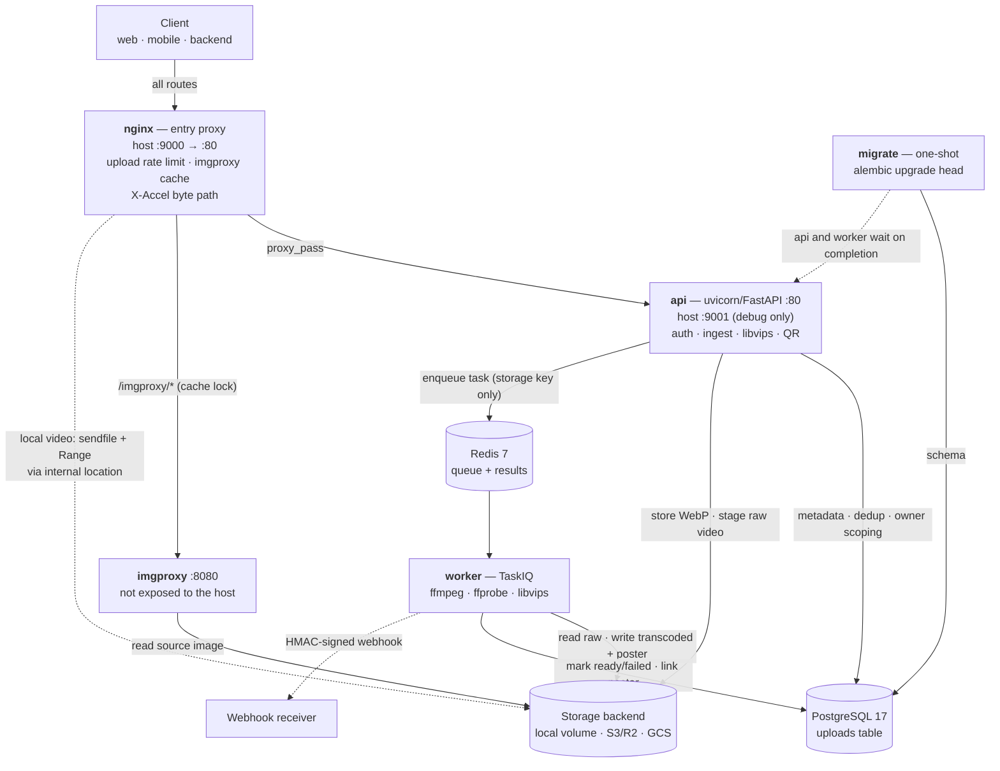
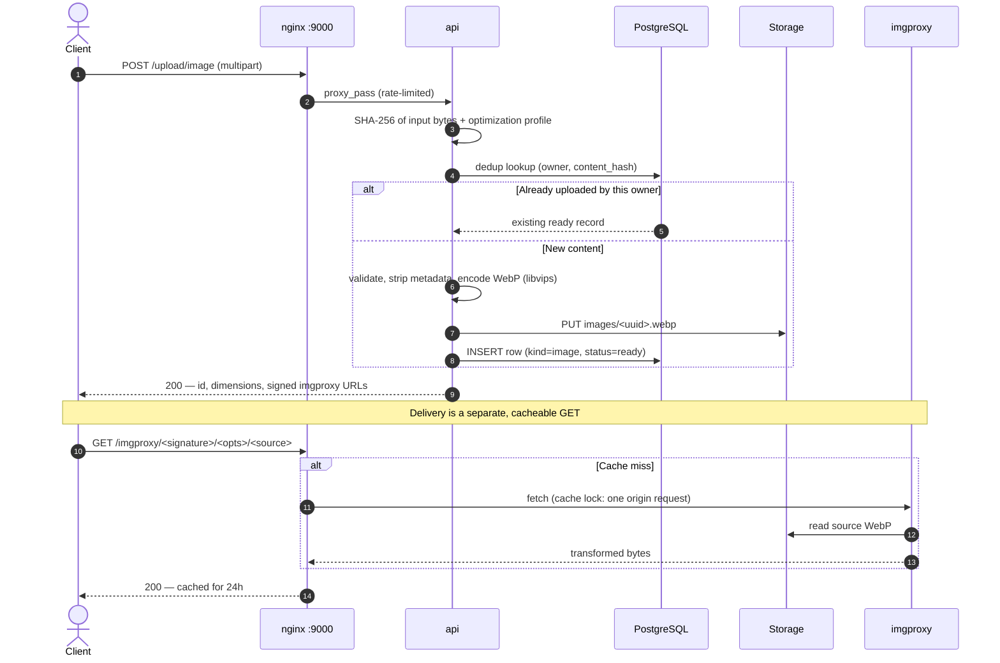
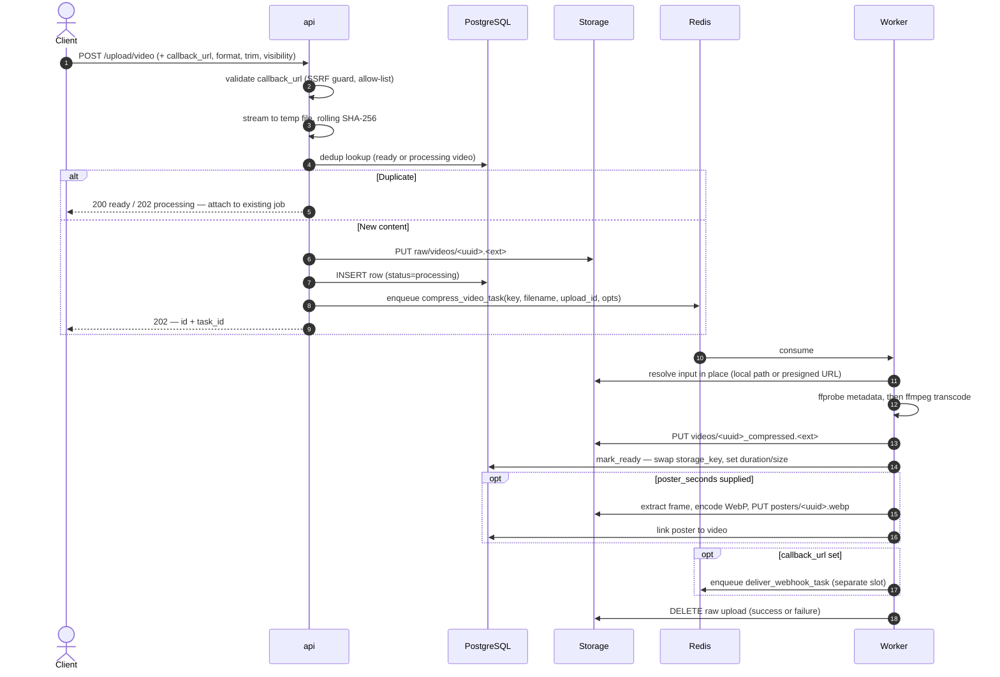
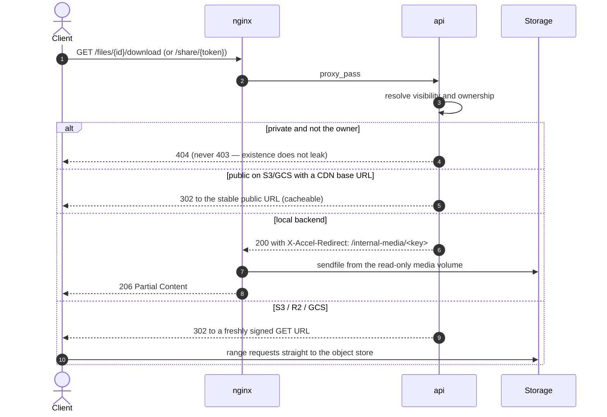

<br>
<p align="center">
  <a href="#">
    
  </a>

  <h3 align="center">Filemanager-FastAPI</h3>

  <p align="center">
    A media-processing microservice: images, video, and QR codes.
  </p>
</p>

<p align="center">
  <a href="https://github.com/JexPY/filemanager-fastapi/actions/workflows/ci.yml"></a>
  <a href="https://github.com/JexPY/filemanager-fastapi/actions/workflows/codeql.yml"></a>
  <a href="https://sonarcloud.io/summary/new_code?id=JexPY_filemanager-fastapi"></a>
  <a href="https://sonarcloud.io/summary/new_code?id=JexPY_filemanager-fastapi"></a>
  <a href="https://snyk.io/test/github/JexPY/filemanager-fastapi"></a>
  <a href="https://opensource.org/licenses/MIT"></a>
</p>

---

Upload an image and get back a stripped, re-encoded WebP plus signed imgproxy URLs for
on-demand resizing. Upload a video and get back a task id while a separate worker
transcodes it, extracts a poster frame, and pushes a signed webhook when it lands.
Generate QR codes inline. Storage is pluggable: local disk, S3/R2/Garage, or Google Cloud
Storage.

Everything runs in Docker. `docker compose up --build` gives you the whole stack.

> Interactive API docs at `/docs` (Swagger UI) and `/redoc`.
> Deployment guidance lives in [`docs/PRODUCTION.md`](docs/PRODUCTION.md).

## Contents

- [Quickstart](#quickstart)
- [Architecture](#architecture)
- [Request flows](#request-flows)
- [API reference](#api-reference)
- [Authentication](#authentication)
- [Storage backends](#storage-backends)
- [Webhooks](#webhooks)
- [Configuration](#configuration)
- [Development](#development)
- [Limits and scope](#limits-and-scope)
- [A note on v1](#a-note-on-v1)

---

## Quickstart

```sh
cp .env-example .env

# Generate two distinct secrets and put them in .env as IMGPROXY_KEY / IMGPROXY_SALT.
# They must match the imgproxy container's env vars exactly (compose reads the same file).
openssl rand -hex 32
openssl rand -hex 32

# Set at least one bearer token, e.g.
#   FILE_MANAGER_BEARER_TOKENS=mobile:s3cr3t-a,admin:s3cr3t-b
# (or a bare `secret` — the owner id is then derived as tok_<hash>)

docker compose up --build
```

The service comes up behind nginx at **`http://localhost:9000`**. Swagger UI is at
`http://localhost:9000/docs`. The `migrate` service applies Alembic migrations and exits
before `api` and `worker` start.

The app refuses to boot on a bad config rather than failing on the first request: a
missing bucket for the selected backend, an empty token list, or a non-hex imgproxy
key/salt is a startup error.

```sh
TOKEN=your-token-here
BASE=http://localhost:9000

# Image — synchronous. Returns the record id plus signed imgproxy URLs.
curl -H "Authorization: Bearer $TOKEN" -F "file=@photo.jpg" $BASE/upload/image

# Video — asynchronous. Returns 202 with a task_id and record id.
curl -H "Authorization: Bearer $TOKEN" -F "file=@clip.mp4" $BASE/upload/video

# Poll the task, or poll the record for richer state.
curl -H "Authorization: Bearer $TOKEN" $BASE/tasks/<task_id>
curl -H "Authorization: Bearer $TOKEN" $BASE/files/<id>

# List your uploads (owner-scoped — you only ever see your own).
curl -H "Authorization: Bearer $TOKEN" "$BASE/files?limit=20&kind=video"

# QR codes — returned inline as PNG, never stored.
curl -H "Authorization: Bearer $TOKEN" -F "content=https://example.com" \
  $BASE/generate/qrcode -o qr.png

curl -H "Authorization: Bearer $TOKEN" -F "ssid=MyHomeWiFi" -F "password=secret" \
  -F "logo=@logo.png" $BASE/generate/qrcode/wifi -o wifi_qr.png
```

---

## Architecture

Two process types share one codebase, selected by which command runs. `api` serves every
HTTP route; `worker` runs FFmpeg. They are coupled only through Redis, Postgres, and the
storage backend — no shared memory, no in-process state.

nginx is the mandatory entry proxy. It rate-limits uploads, acts as an origin shield in
front of imgproxy, and — on the `local` backend — serves video bytes itself via
`X-Accel-Redirect`, keeping the Python process out of the byte path entirely.

### Container topology



Notes on the topology as it is actually wired:

- **imgproxy publishes no host port.** All image transforms go through
  `nginx:/imgproxy/`, which is where `proxy_cache_lock` prevents a cache stampede on the
  origin. `IMGPROXY_BASE_URL` should therefore point at nginx, not at imgproxy.
- **The api's host port 9001 is for debugging only.** Only nginx interprets
  `X-Accel-Redirect`, so local video playback does not work if you hit `:9001` directly.
- **`/internal-media/` in nginx is marked `internal;`.** It can only be entered via an
  upstream `X-Accel-Redirect`, never by a direct client request. That is what keeps the
  download route's visibility and ownership checks from being bypassable.
- **Uploads are rate-limited at the edge**, at 2 req/s per IP with a burst of 5, on
  `/upload/image`, `/upload/images`, and `/upload/video`; over the burst is a 429. Read,
  list, and health routes are unrestricted.
- **Only the storage key travels through Redis**, never the bytes. The worker fetches
  the object itself.

---

## Request flows

### Image ingestion and thumbnail delivery

Images are handled synchronously. The input bytes are hashed for per-owner idempotency,
then decoded, stripped of all metadata (EXIF, GPS, ICC, XMP), and re-encoded to WebP with
libvips. Clients get signed imgproxy URLs and let imgproxy do the resizing.



### Asynchronous video transcoding

The upload streams straight to a temp file and is hashed as it lands, so memory stays
bounded regardless of file size. The record is written as `processing` **before** the task
is enqueued, so the worker can never observe a task whose row does not exist yet.



If the owner deletes the upload mid-transcode, `mark_ready` finds no row and the worker
discards the object it just wrote rather than orphaning it. On any failure the row is
marked `failed` and the error re-raised, so `GET /tasks/{id}` reports it too.

### Playback

`GET /files/{id}/download` is the permanent, backend-agnostic URL clients embed. It never
proxies bytes — it either hands nginx an internal redirect or 302s to a signed object-store
URL. HTTP Range works on every path.



A **share token** is a separate capability: `POST /files/{id}/share` mints a
`secrets.token_urlsafe(32)` and is the only response that ever returns it. It is excluded
from every record view, so it cannot leak through listings, webhooks, or their logs.
`GET /share/{token}` then serves the video regardless of visibility, with no bearer token.

---

## API reference

Every `/files` route is owner-scoped: another owner's record is a **404, never a 403**, so
existence never leaks across tenants.

### Uploads

| Method | Endpoint | Auth | Notes |
|---|---|---|---|
| `POST` | `/upload/image` | `upload:image` | Synchronous. Strips metadata, encodes WebP, returns signed imgproxy URLs. Idempotent per owner. |
| `POST` | `/upload/images` | `upload:image` | Bulk, max 10 files / 50 MB total, 4 concurrent. Failed items are skipped, not fatal. |
| `POST` | `/upload/video` | `upload:video` | Streams to disk, stages, enqueues transcode. `202`, or `200`/`202` on a duplicate. |
| `POST` | `/upload/presign` | master token only | Mints a short-lived capability JWT and a ready-to-use upload URL. `503` if `JWT_SECRET_KEY` is unset. |

`POST /upload/image` form fields: `file`, `optimization` (`size`\|`balanced`\|`quality`,
default `balanced`), `imgproxy_width`, `imgproxy_height`, `imgproxy_fit`
(`auto`\|`fit`\|`fill`\|`fill-down`\|`force`), `imgproxy_format`
(`webp`\|`png`\|`jpg`\|`jpeg`\|`avif`\|`gif`). Supplying any custom transform adds an
`imgproxy_custom_url` to the response.

`POST /upload/video` form fields:

| Field | Values | Meaning |
|---|---|---|
| `format` | `mp4` (default), `webm_vp9`, `webm_av1` | Output container and codec pair. |
| `optimization` | `balanced` (default), `quality` | `balanced` caps width at 1280; `quality` at 1920. |
| `start_seconds` / `end_seconds` | float | Trim the source before encoding. |
| `poster_seconds` | float | Extract a poster frame automatically at this timestamp. |
| `visibility` | `public` (default), `private` | Playback access model for the record. |
| `callback_url` | https URL | Webhook target. Validated at upload time; rejected with `400` if webhooks are off or the host is not allow-listed. |

Codecs per format: `mp4` uses libx264 + AAC with `+faststart`; `webm_vp9` uses libvpx-vp9
+ Opus; `webm_av1` uses SVT-AV1 + Opus.

> **Output is capped at 60 seconds by default.** `VIDEO_MAX_DURATION_SECONDS` is an
> ffmpeg `-t` limit on the encode, so a longer upload is accepted and transcoded but comes
> back trimmed. This is not silent: the record reports `duration_seconds` (the source's
> real length) and `truncated: true`. Raise or disable it (`0` removes the cap) if you are
> handling full-length media.

### Files, playback, and sharing

| Method | Endpoint | Auth | Notes |
|---|---|---|---|
| `GET` | `/files` | bearer | Newest first. Query: `limit` (1–200, default 50), `offset`, `kind` (`image`\|`video`). |
| `GET` | `/files/{id}` | bearer | Full record. Poll this for `status`, `poster_upload_id`, and webhook state. |
| `PATCH` | `/files/{id}` | bearer | Body `{"visibility": "public"}` or `{"visibility": "private"}`. Videos only — `400` on an image. |
| `DELETE` | `/files/{id}` | bearer | Deletes the object first, then the row. Cascades to the video's poster. |
| `GET` | `/files/{id}/download` | bearer or public | Stable playback URL, Range on every backend. Videos only. |
| `POST` | `/files/{id}/share` | bearer | Mints or rotates the share token. The only response that returns it. |
| `DELETE` | `/files/{id}/share` | bearer | Revokes it. Idempotent. |
| `GET` | `/share/{token}` | none | Streams the video; the token is the grant. Unknown or revoked is a 404. |
| `POST` | `/files/{id}/poster` | bearer | On-demand poster from a *ready* video. `at_seconds` optional, default ~10% in. `200` if one already exists, `202` if enqueued. |
| `POST` | `/files/{id}/redeliver` | bearer | Replays a dead-lettered webhook with the same idempotency id. |

### Tasks, QR codes, and system

| Method | Endpoint | Auth | Notes |
|---|---|---|---|
| `GET` | `/tasks/{task_id}` | bearer | `pending` \| `completed` \| `failed`. Owner-scoped via the record, so an unknown id is a 404. |
| `POST` | `/generate/qrcode` | bearer | Plain text or URL. |
| `POST` | `/generate/qrcode/wifi` | bearer | `ssid`, `password`, `security` (`WPA`\|`WEP`\|`nopass`), `hidden`. |
| `POST` | `/generate/qrcode/vcard` | bearer | vCard 3.0 contact card. |
| `POST` | `/generate/qrcode/mecard` | bearer | Compact MeCard contact. |
| `POST` | `/generate/qrcode/geo` | bearer | Latitude / longitude. |
| `POST` | `/generate/qrcode/epc` | bearer | SEPA EPC payment. |
| `GET` | `/healthz` | none | Liveness. Always 200 if the process is serving. |
| `GET` | `/readyz` | none | Readiness. 200 only if Redis, storage, and Postgres are all reachable; 503 otherwise. |

All QR routes return a PNG inline, accept an optional `logo` overlay and a `scale` (1–20),
and store nothing — there is no record to fetch afterwards.

---

## Authentication

Two credential shapes resolve to the same owner identity.

**Static master tokens** — the entries in `FILE_MANAGER_BEARER_TOKENS`, compared in
constant time. Unrestricted: they bypass every scope check. Each entry is either a bare
`secret` (owner derived as `tok_<hash>`, so the secret is never stored in records) or
`label:secret` (owner = `label`, for a readable audit trail). The client always sends just
the secret.

**Capability JWTs** — short-lived HS256 tokens signed with `JWT_SECRET_KEY`, carrying
`sub` (owner), `exp` (strictly enforced), and `scopes`. Scopes gate **only the three
upload verbs**; for every other owner-scoped route a JWT behaves exactly like a static
token for its `sub`. A bad, expired, or mis-signed token is a flat `401` with no
explanation of why.

JWT auth is off unless `JWT_SECRET_KEY` is set. Leave it blank and only static tokens are
accepted — the original behavior — and `/upload/presign` returns `503`.

Either shape may ride the `Authorization: Bearer` header **or** a `?token=` query
parameter, with identical validation. The query form exists for clients that cannot set
headers — a plain `<form>` POST, or a `<video src>` pointing at a private download URL.

### Direct browser uploads

`/upload/presign` lets a trusted backend hand an untrusted frontend a scoped, expiring
upload URL, so file bytes never round-trip your main backend. It requires a static master
token, which means a leaked JWT can never mint more JWTs.

```sh
curl -X POST -H "Authorization: Bearer $MASTER_TOKEN" \
  -H "Content-Type: application/json" \
  -d '{"kind":"image","owner_id":"tenant-42","expires_in_seconds":300}' \
  $BASE/upload/presign
# -> { "url": "https://media.example.com/upload/image?token=<jwt>",
#      "token": "<jwt>", "expires_at": 1760000000, "scope": "upload:image" }
```

---

## Storage backends

Selected with `STORAGE_BACKEND`. The choice changes both how imgproxy reaches source
images and how video bytes are delivered.

| | `local` | `s3` (S3 / R2 / Garage) | `gcp` |
|---|---|---|---|
| Objects live in | `LOCAL_STORAGE_DIR` volume | `S3_BUCKET` | `GCS_BUCKET` |
| imgproxy source | `local://` on a shared read-only mount | presigned or public URL | presigned or public URL |
| Video byte path | nginx `X-Accel-Redirect` (sendfile + Range) | 302 to a presigned GET | 302 to a V4 signed URL |
| Public video URL | not applicable — always served through nginx | 302 to `S3_PUBLIC_BASE_URL` when set | 302 to `GCS_PUBLIC_BASE_URL` when set |
| Verified | end to end | end to end against Garage | unit-tested with a mocked client only |

The three `*_PUBLIC_BASE_URL` settings are independent on purpose, so switching backends
cannot silently reuse a URL configured for a different one. Putting a CDN in front is a
deploy concern with no code change: point the relevant `*_PUBLIC_BASE_URL` at the CDN
domain.

Storage keys are `images/<uuid>.webp`, `raw/videos/<uuid>.<ext>`,
`videos/<uuid>_compressed.<ext>`, and `posters/<uuid>.webp`. Client-supplied filenames are
sanitized to `[a-z0-9]{,8}` before they can reach a key.

Run against a local S3-compatible server. The fixture is [Garage](https://garagehq.deuxfleurs.fr/)
(pinned to `dxflrs/garage:v2.3.0`), which replaced MinIO after that project was archived in
April 2026. It boots with `--single-node --default-bucket`, so the cluster layout, the
bucket, and the credentials are all provisioned before the S3 API starts listening;
`garage-init` is a one-shot readiness gate that exits once the cluster reports healthy.

```sh
docker compose --profile s3-dev up -d --wait garage garage-init
# then in .env:
#   STORAGE_BACKEND=s3
#   S3_BUCKET=filemanager-test
#   S3_ENDPOINT_URL=http://garage:3900
#   AWS_REGION=garage
#   AWS_ACCESS_KEY_ID=garageadmin
#   AWS_SECRET_ACCESS_KEY=garageadminsecretkey
```

`AWS_REGION` must match Garage's configured `s3_region`, because SigV4 binds the region into
the credential scope. The S3 API is on host port 9002 and Garage's admin/health API on 9003
(the ports MinIO used), clear of nginx on 9000 and the api's debug port on 9001.

The `s3_integration`-marked tests in `tests/test_storage_s3_integration.py` run against this
fixture and cover what client-side signing tests cannot: a real multipart upload, a presigned
GET that is actually fetched, and a Range request returning 206. They skip when no endpoint is
reachable; set `S3_INTEGRATION_REQUIRED=1` (CI does) to make that a failure instead.

---

## Webhooks

Pass `callback_url` on `POST /upload/video` and the service POSTs a signed payload when
transcoding reaches a terminal state (`video.completed` or `video.failed`).

Webhooks are **off unless both `WEBHOOK_SIGNING_SECRET` and `WEBHOOK_ALLOWED_HOSTS` are
set**; with them unset, any `callback_url` is rejected with a `400`.

The URL is admitted at upload time, before anything is staged: https-only unless
`WEBHOOK_ALLOW_INSECURE_HTTP`, the host must be on the explicit allow-list, and unless
`WEBHOOK_ALLOW_PRIVATE_IPS` it must not resolve to a private, loopback, or link-local
address. The allow-list is the authoritative egress control; the IP check is defence in
depth.

Delivery runs on its own task, so a slow receiver ties up a delivery slot rather than a
transcoding slot. Headers on each attempt:

| Header | Value |
|---|---|
| `X-Webhook-Signature` | HMAC-SHA256 over `timestamp.body`, keyed with `WEBHOOK_SIGNING_SECRET` |
| `X-Webhook-Id` | The upload id — stable across retries, so receivers can dedupe |

Failed deliveries retry with exponential backoff up to `WEBHOOK_MAX_ATTEMPTS`. An
exhausted delivery is a durable dead-letter record on the row
(`webhook_status`, `webhook_attempts`, `webhook_last_error`), not just a log line — replay
it with `POST /files/{id}/redeliver`.

---

## Configuration

Full annotated list in [`.env-example`](.env-example). The settings you are most likely to
touch:

### Core

| Variable | Default | Purpose |
|---|---|---|
| `FILE_MANAGER_BEARER_TOKENS` | — | Comma-separated `secret` or `label:secret`. **Required**; empty fails startup. |
| `STORAGE_BACKEND` | `local` | `local` \| `s3` \| `gcp`. |
| `DATABASE_URL` | — | Postgres DSN for the metadata store. |
| `REDIS_URL` | `redis://redis:6379/0` | TaskIQ broker and result backend. |
| `PUBLIC_BASE_URL` | — | This service's external origin. Makes share/download URLs absolute. |

### imgproxy and nginx

| Variable | Default | Purpose |
|---|---|---|
| `IMGPROXY_KEY` / `IMGPROXY_SALT` | — | Hex-encoded, must differ, must match the imgproxy container exactly. **Required.** |
| `IMGPROXY_BASE_URL` | — | Where imgproxy is reachable. Point at nginx, e.g. `http://localhost:9000/imgproxy`. |
| `ENABLE_IMGPROXY_CACHE` | `true` | Toggles the nginx origin-shield cache. |
| `NGINX_MAX_BODY_SIZE` | `2000m` | Edge body cap. Keep at or above `MAX_VIDEO_UPLOAD_BYTES` or nginx 413s before the app's own check. |

### Limits

| Variable | Default | Purpose |
|---|---|---|
| `MAX_IMAGE_UPLOAD_BYTES` | 25 MiB | Per-image cap. |
| `MAX_VIDEO_UPLOAD_BYTES` | 2000 MiB | Per-video cap, enforced while streaming to disk. |
| `MAX_IMAGE_PIXELS` | 50,000,000 | Decompression-bomb guard, checked before the full-resolution encode. |
| `MAX_QR_CONTENT_LENGTH` | 2000 | Rejects oversized QR payloads before they reach segno. |
| `MAX_QR_LOGO_BYTES` | 5 MiB | Logo overlay cap. |

### Video pipeline

| Variable | Default | Purpose |
|---|---|---|
| `VIDEO_MAX_DURATION_SECONDS` | 60 | Caps compressed output duration (ffmpeg `-t`). Longer inputs are trimmed and flagged `truncated`. `0` disables the cap. |
| `FFMPEG_TIMEOUT_SECONDS` | 120 | Wall-clock kill for a wedged transcode. |
| `FFPROBE_TIMEOUT_SECONDS` | 15 | Separate, much shorter budget for the metadata probe. |
| `FFMPEG_INPUT_URL_TTL_SECONDS` | 3600 | TTL of the presigned URL the worker hands ffmpeg as input on s3/gcp. Must exceed the ffmpeg timeout. |
| `VIDEO_PLAYBACK_URL_TTL_SECONDS` | 21600 | TTL of the signed playback URL. Size it to a viewing session. |
| `LOCAL_MEDIA_SERVE_MODE` | `xaccel` | `xaccel` for production (nginx serves bytes) or `direct` for a no-nginx dev setup. |

### Optional features

| Variable | Default | Purpose |
|---|---|---|
| `JWT_SECRET_KEY` | — | Enables capability JWTs and `/upload/presign`. Blank means static tokens only. |
| `JWT_ALGORITHM` | `HS256` | Signing algorithm for the above. |
| `WEBHOOK_SIGNING_SECRET` | — | HMAC key. Required (with the allow-list) to enable webhooks. |
| `WEBHOOK_ALLOWED_HOSTS` | — | Comma-separated allow-list of callback hosts. |
| `WEBHOOK_ALLOW_INSECURE_HTTP` | `false` | Permit `http://` callbacks. |
| `WEBHOOK_ALLOW_PRIVATE_IPS` | `false` | Permit callbacks resolving to private or loopback addresses. |
| `WEBHOOK_TIMEOUT_SECONDS` | `10` | Per-attempt HTTP timeout. |
| `WEBHOOK_MAX_ATTEMPTS` | `4` | Attempts before dead-lettering. |
| `WEBHOOK_RETRY_BACKOFF_SECONDS` | `1.0` | Exponential backoff base. |

---

## Development

Everything runs inside Docker. There is no supported local Python environment — unresolved
imports in your editor are expected noise, not a problem to fix.

```sh
docker compose up --build          # full stack
docker compose up worker           # worker only
```

> **Always pass `--build` to the `test` service.** Its image bakes the source in at build
> time rather than bind-mounting it, so `run` without `--build` silently re-runs your
> previous code.

```sh
docker compose run --rm --build test pytest -v
docker compose run --rm --build test ruff check .
docker compose run --rm --build test ruff format --check .
docker compose run --rm --build test mypy app

# Skip the tests that need live Postgres:
docker compose run --rm --build test pytest -m "not pg_integration"
```

Note `ruff format --check` rather than a bare `ruff format`: the container has its own
baked-in copy of the source, so a rewrite there is discarded with the container and never
reaches your working tree. Use `--check` to find the offending files, then fix them in
your editor.

### Migrations

Alembic owns the `uploads` schema; revisions live in `migrations/`. There is no ORM model
layer, so revisions are hand-written rather than autogenerated.

```sh
docker compose run --rm migrate                        # upgrade head (the default)
docker compose run --rm migrate alembic current        # show the applied revision
docker compose run --rm migrate alembic downgrade -1   # roll back one
docker compose run --rm migrate alembic revision -m "add whatever column"
```

### Backups

```sh
docker compose --profile backup run --rm db-backup     # pg_dump, pruning dumps older than 7 days
```

### A note on the compose override

`docker-compose.override.yml` is checked in and dev-only. Compose merges it automatically
into any bare `docker compose` command from this directory, and it unconditionally replaces
the `api` and `worker` commands with single-process reload variants plus a live-mount of
`./app`. A production-facing change to `Dockerfile.api`'s `CMD` is real in the built image
but invisible under a default local `up`. To verify one, inspect the running container or
run `docker compose -f docker-compose.yml up` to exclude the override.

---

## Limits and scope

Deliberate boundaries, stated plainly rather than discovered later:

- **Not a general file host.** No cross-owner listing, no search, no public index.
  Deletion is explicit and irreversible.
- **Progressive playback only.** HTTP Range works everywhere; HLS and adaptive bitrate are
  out of scope.
- **Video output is trimmed to `VIDEO_MAX_DURATION_SECONDS` (60s by default).** The service
  is built around short-form media; long-form needs that cap raised or disabled, and the
  `FFMPEG_TIMEOUT_SECONDS` budget widened to match.
- **Image uploads are fully buffered in memory** by design, bounded by
  `MAX_IMAGE_UPLOAD_BYTES`. Video upload and worker processing stream to and from disk with
  bounded memory on every backend.
- **All metadata is stripped from images** — EXIF, GPS, ICC profile, XMP — on every
  re-encode. This is not configurable per request.
- **Scopes are coarse.** `upload:image` and `upload:video` are the entire taxonomy, and
  they gate only the upload verbs. There are no read-only, read-write, or admin roles.
- **Webhook replay is manual.** Dead-lettered deliveries are durable and replayable, but
  nothing re-attempts them on a schedule.
- **Signed playback URLs expire.** A player caches the resolved URL, so a seek after
  `VIDEO_PLAYBACK_URL_TTL_SECONDS` can hit an expired signature. CDN signed cookies would
  be the bulletproof fix; sizing the TTL is the current mitigation.
- **No presigned direct-to-storage uploads.** Every byte still proxies through `api`.
- **No retries or circuit breakers** around Redis, S3/GCS, imgproxy, or Postgres. Failures
  are fail-closed and visible (a generic `502`), which is correct but is not a resilience
  layer.
- **TLS is not shipped.** nginx terminates plain HTTP. Add a TLS terminator or an upstream
  load balancer / ingress for production.

---

## A note on v1

This started as a handwritten side project — no LLM assistance, just curiosity and a need
for a file-management microservice that did what I wanted. That original version lives on
the [`before_llm`](https://github.com/JexPY/filemanager-fastapi/tree/before_llm) branch as
a snapshot of where it began: Pillow-SIMD, libcloud, a rougher but honest codebase. Worth
a look if you are curious about the evolution.

The current version is a full rewrite with a hardened architecture and async-first
internals, but the spirit is the same.

---

## License

MIT — see [`LICENSE.txt`](LICENSE.txt).

Security issues: see [`SECURITY.md`](SECURITY.md). PRs welcome; if something is broken or
confusing, open an issue.
