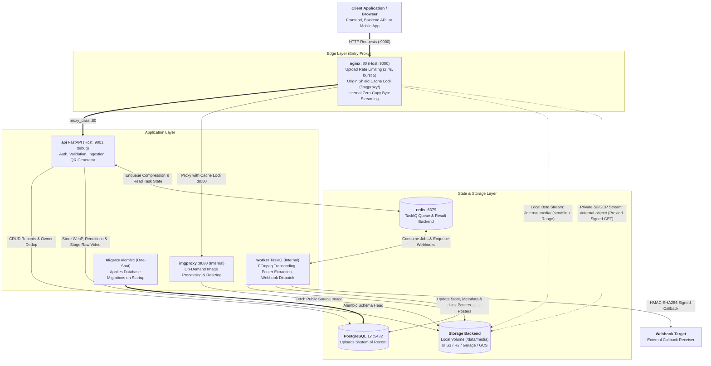
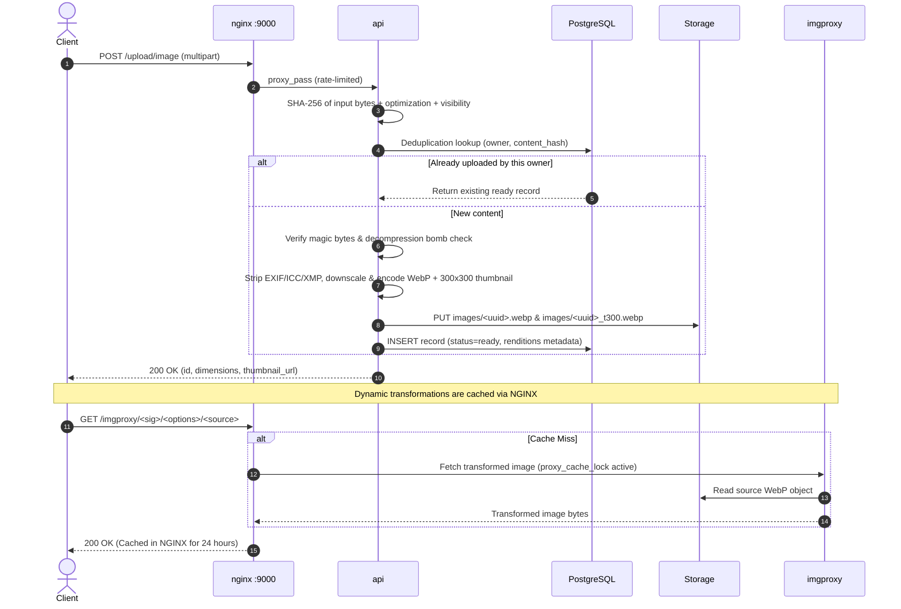
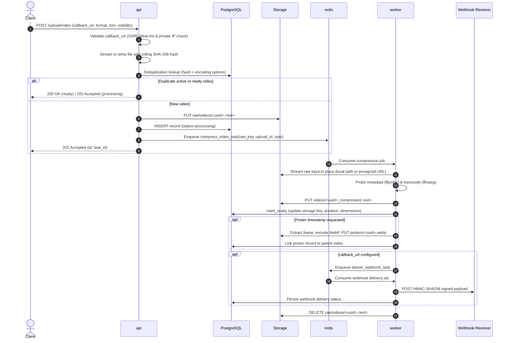
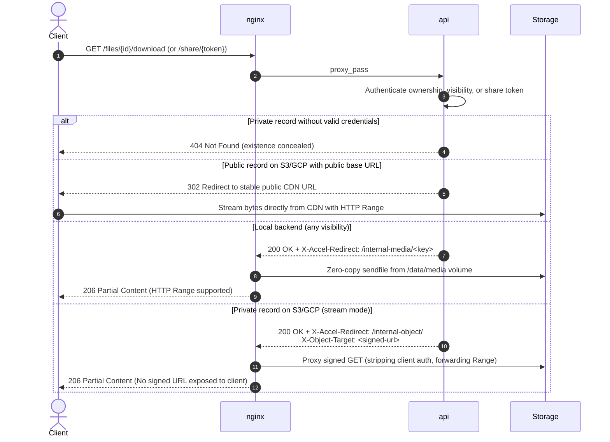

<br>
<p align="center">
  <a href="#">
    
  </a>

  <h3 align="center">Filemanager-FastAPI</h3>

  <p align="center">
    A high-performance media-processing microservice: images, video, generic files, and QR codes.
  </p>
</p>

<p align="center">
  <a href="https://github.com/JexPY/filemanager-fastapi/actions/workflows/ci.yml"></a>
  <a href="https://github.com/JexPY/filemanager-fastapi/actions/workflows/codeql.yml"></a>
  <a href="https://sonarcloud.io/summary/new_code?id=JexPY_filemanager-fastapi"></a>
  <a href="https://sonarcloud.io/summary/new_code?id=JexPY_filemanager-fastapi"></a>
  <a href="https://snyk.io/test/github/JexPY/filemanager-fastapi"></a>
  <a href="https://opensource.org/licenses/MIT"></a>
</p>

---

**Upload an image** and receive a stripped, re-encoded WebP, a materialized 300x300
thumbnail, and signed imgproxy URLs for on-demand transformations. **Upload a video** and
receive an immediate task ID while an asynchronous worker transcodes it via FFmpeg, extracts
poster frames, and dispatches HMAC-signed webhooks upon completion. **Upload generic files**
(PDFs, audio, archives) through a strict allow-list with magic-byte verification.
**Generate QR codes** inline as PNG. Storage is pluggable across local filesystem volumes,
S3-compatible object storage (AWS S3, Cloudflare R2, Garage), and Google Cloud Storage.

Everything runs containerized in Docker. `docker compose up --build` provisions the full stack.

> Interactive API documentation is available at `/docs` (Swagger UI) and `/redoc`.
> Production deployment and hardening guidance lives in [`docs/PRODUCTION.md`](docs/PRODUCTION.md).

## Contents

**Start here** — [Quickstart](#quickstart) · [Core concepts](#core-concepts) · [Which URL do I use](#which-url-do-i-use)

**How it works** — [Architecture & Container Topology](#architecture--container-topology) · [Storage backends](#storage-backends)

**Reference** — [API reference](#api-reference) · [Authentication & Access Control](#authentication--access-control) · [Webhooks](#webhooks) · [Configuration Reference](#configuration-reference)

**Operations** — [Development & Testing](#development--testing) · [Limits and scope](#limits-and-scope)

---

## Quickstart

### 1. Configure

```sh
cp .env-example .env

# Generate two distinct 32-byte hex secrets for imgproxy signature verification
openssl rand -hex 32   # Set as IMGPROXY_KEY in .env
openssl rand -hex 32   # Set as IMGPROXY_SALT in .env
```

Configure at least one master bearer token in `.env`:

```ini
# .env — comma-separated list of `secret` or `label:secret` for human-readable audit logs
FILE_MANAGER_BEARER_TOKENS=backend:s3cr3t-a,admin:s3cr3t-b
```

The application validates configuration eagerly at startup and fails fast on errors:
missing buckets for the active storage backend, empty token lists, malformed hex for
`IMGPROXY_KEY`/`IMGPROXY_SALT`, or invalid media serve modes.

### 2. Run

```sh
docker compose up --build
```

The service binds behind NGINX at **`http://localhost:9000`** (Swagger UI at
`http://localhost:9000/docs`). A one-shot `migrate` container automatically applies
Alembic database migrations and exits before the API and worker services accept traffic.

> When using `STORAGE_BACKEND=s3` or `gcp`, set the corresponding `*_PUBLIC_BASE_URL`
> and `IMGPROXY_ALLOWED_SOURCES`. Without a public base URL, imgproxy cannot resolve
> object URLs for dynamic resizing of public media.

### 3. Call it

```sh
TOKEN=your-token-here
BASE=http://localhost:9000

# Health and readiness check (verifies Redis, PostgreSQL, and storage initialization)
curl $BASE/readyz

# Image upload (synchronous) — returns record ID, dimensions, and thumbnail URLs
curl -H "Authorization: Bearer $TOKEN" -F "file=@photo.jpg" $BASE/upload/image

# Video upload (asynchronous) — returns 202 Accepted with task_id and record ID
curl -H "Authorization: Bearer $TOKEN" -F "file=@clip.mp4" $BASE/upload/video

# Generic file upload (PDF, audio, archive) — returns 200 OK at status='ready'
curl -H "Authorization: Bearer $TOKEN" -F "file=@document.pdf" $BASE/upload/file

# Poll compression task status or retrieve full record details
curl -H "Authorization: Bearer $TOKEN" $BASE/tasks/<task_id>
curl -H "Authorization: Bearer $TOKEN" $BASE/files/<id>

# List uploaded files (strictly owner-scoped — tenants only see their own records)
curl -H "Authorization: Bearer $TOKEN" "$BASE/files?limit=20&kind=video"

# Generate QR codes inline (returned as PNG streams, never stored)
curl -H "Authorization: Bearer $TOKEN" -F "content=https://example.com" \
  $BASE/generate/qrcode -o qr.png

curl -H "Authorization: Bearer $TOKEN" -F "ssid=MyHomeWiFi" -F "password=secret" \
  -F "logo=@logo.png" $BASE/generate/qrcode/wifi -o wifi_qr.png
```

Sample public image upload response:

```json
{
  "status": "success",
  "id": "0f1c2b7a5e4d4a9c8f2b1d6e3a7c0b95",
  "size_bytes": 84210,
  "size_mb": 0.08,
  "dimensions": { "width": 1920, "height": 1080 },
  "imgproxy_thumbnail_url": "https://media.example.com/imgproxy/<sig>/rs:auto/<src>"
}
```

Persist the `id`. It is the authoritative handle for record lookup, canonical download,
sharing, visibility toggling, and deletion.

---

## Core concepts

### 1. Owner scoping & multi-tenancy
Every credential (static master token or capability JWT) resolves to an owner identity.
Listing, fetching, modifying, deleting, poster generation, and task polling are strictly
owner-scoped. Requesting another owner's record returns **404 Not Found (never 403)**,
ensuring resource existence is never leaked across tenants. Unauthenticated or public
access is strictly opt-in per record: public downloads, unlisted share tokens, or signed
single-file `read:file` grants.

### 2. System of record
Every upload (image, video, or generic file) creates an entry in the PostgreSQL `uploads`
table, retrievable via `GET /files/{id}`. This record tracks status, dimensions, duration,
truncation flags, visibility, linked poster IDs, and webhook delivery state. QR codes are
the sole exception; they are generated dynamically and never persisted.

### 3. Media kinds & lifecycle states
Images and generic files are processed synchronously and stored immediately at `status='ready'`.
Videos are registered as `status='processing'` before the transcode job is enqueued in Redis,
guaranteeing the worker never encounters an unrecorded job. The worker transitions the record
to `status='ready'` upon successful compression or `status='failed'` on error.

| Kind | Ingestion Route | Initial Status | Processing Pipeline |
|---|---|---|---|
| `image` | `POST /upload/image`, `POST /upload/images` | `ready` | Synchronous: strip metadata, downscale, WebP encode, materialize 300x300 thumbnail |
| `video` | `POST /upload/video` | `processing` -> `ready`/`failed` | Asynchronous: TaskIQ worker running FFmpeg transcode & probe |
| `file` | `POST /upload/file` | `ready` | Synchronous: magic-byte verification, MIME allow-list validation, stream-scan |

### 4. Visibility & authorization model
Every record has a `visibility` attribute (`public` or `private`), configured at upload and
updatable via `PATCH /files/{id}`. Visibility governs both access authorization and URL exposure:

| Feature | `public` | `private` |
|---|---|---|
| `GET /files/{id}/download` | Accessible to anyone with the record ID (no token required) | Accessible only by the owner or a scoped `read:file` token (unauthorized requests return 404) |
| Accelerator URLs | Handed out in record responses (`direct_url`, `thumbnail_url`, `poster_url`) | Withheld from responses (preventing unauthenticated bypasses) |
| Share links | Functional | Functional (the unlisted token acts as its own grant) |

### 5. Idempotent deduplication
All uploads are deduplicated per owner based on a SHA-256 hash of the input bytes folded
with processing parameters. Re-uploading identical content with identical options returns
the existing record without redundant transcoding or storage overhead.

| Kind | Deduplication Key Composition | Match Scope |
|---|---|---|
| `image` | `SHA-256(raw_input_hash:optimization:visibility)` | Existing `ready` records for the owner |
| `file` | `SHA-256(raw_input_hash:visibility)` | Existing `ready` records for the owner |
| `video` | `SHA-256(raw_input_hash:format:optimization:start_seconds:end_seconds:poster_seconds)` | Existing `ready` or `processing` records for the owner |

Matching an active `processing` video returns `202 Accepted` and attaches the caller to the
in-flight job. `failed` rows are excluded from deduplication so bad inputs can be retried cleanly.

---

## Which URL do I use

Persist the record ID in your database rather than external URLs. The record ID is permanent,
while derivative and accelerator URLs can be regenerated on demand.

| Use Case | Recommended URL | Description & Access Model |
|---|---|---|
| Permanent canonical address | `url` (`GET /files/{id}/download`) | Universal, backend-agnostic URL. Safe to store and embed for all media kinds and visibilities. |
| 300x300 thumbnail of a public image | `thumbnail_url` | Direct CDN/object read of the materialized WebP thumbnail (falls back to imgproxy). |
| Thumbnail of a private image | `GET /files/{id}/download?rendition=thumb` | Requires owner bearer auth or a scoped `read:file` token. Also supports `?rendition=t300`. |
| Lowest-latency public direct read | `direct_url` | Direct CDN/bucket URL on `s3`/`gcp` with a public base URL. Unauthenticated, no redirect hop. |
| Custom image transformation | `imgproxy_custom_url` | Returned on public uploads when custom resize/crop/format parameters are provided. |
| Anonymous external sharing | `POST /files/{id}/share` -> `share_url` | Unlisted 32-byte secret token. Revocable via API, bypasses visibility restrictions. |
| Scoped end-user access to a private file | Capability JWT with `read:file` | Signed token granting access strictly to one specific file ID for `GET /files/{id}/download`. |

> **Store the ID, not derivative URLs.** Switching storage backends, changing CDN hostnames,
> or rotating secrets alters accelerator URLs. Applications persisting only the record `id`
> remain completely unaffected across infrastructure migrations.

---

## Architecture & Container Topology

The microservice runs as two distinct process types sharing a unified codebase:
`api` (handling HTTP requests via Uvicorn/FastAPI) and `worker` (executing asynchronous
FFmpeg transcoding via TaskIQ). NGINX acts as the mandatory entry reverse proxy, origin
shield, and zero-copy byte streamer.

### Container Topology



#### Key Architecture Properties:
- **Single Public Port:** Only NGINX (`:9000`) is intended for client traffic. Port `:9001` on the API is for debugging only and cannot serve local media (which requires NGINX `X-Accel-Redirect`).
- **Internal Security Boundaries:** The `/internal-media/` and `/internal-object/` locations in NGINX are marked `internal;`. They can only be entered via an upstream `X-Accel-Redirect` from the API, preventing direct client access and ensuring authentication cannot be bypassed.
- **Origin Shielding:** NGINX guards imgproxy via `proxy_cache_lock on;`, collapsing thundering herds of identical resize requests into a single transformation request to protect CPU resources.
- **Edge Rate Limiting:** Upload routes are throttled at NGINX to 2 requests/sec per IP (burst 5) with `proxy_request_buffering off;` so multi-gigabyte video uploads stream directly to the application without edge buffering.
- **Decoupled Key-Only Task Queue:** Only storage keys (strings) travel through Redis; media payload bytes are never passed through queue payloads.

---

### Image Ingestion & Thumbnail Delivery



---

### Asynchronous Video Transcoding & Webhooks



---

### Unified Playback & Media Delivery



---

## API reference

Every route with `{id}` resolves **strictly scoped to your owner namespace**. Another owner's
record returns **404 Not Found**.

### Uploads

| Method | Endpoint | Auth Scope | Description & Behavior |
|---|---|---|---|
| `POST` | `/upload/image` | `upload:image` | Synchronous. Strips metadata, encodes WebP, materializes 300x300 thumbnail. Idempotent per owner. |
| `POST` | `/upload/images` | `upload:image` | Bulk upload (max 10 files / 50 MB total, concurrency 4). Failed individual files are skipped without failing the batch. |
| `POST` | `/upload/video` | `upload:video` | Streams to disk, stages raw video, enqueues transcoding. Returns 202 Accepted. |
| `POST` | `/upload/file` | `upload:file` | Generic ingest (PDF, audio, archives, documents). Validated via magic bytes; stored immediately at `status='ready'`. |
| `POST` | `/upload/presign` | Master token | Mints short-lived capability JWTs and pre-authenticated direct upload URLs for `image`, `video`, or `file`. |

#### Image Ingestion Parameters
- **Form fields:** `file`, `optimization` (`size`|`balanced`|`quality`), `visibility` (`public`|`private`), `imgproxy_width`, `imgproxy_height`, `imgproxy_fit`, `imgproxy_format`.
- **Accepted formats:** PNG, JPEG, GIF, WebP, HEIC (detected via magic bytes). SVG is rejected to prevent SSRF and XML entity expansion attacks.
- **Optimization profiles:**
  - `size`: WebP quality 65, max dimension 1280 px.
  - `balanced` (default): WebP quality 85, max dimension 1920 px.
  - `quality`: WebP quality 95, max dimension 3840 px.

#### Video Ingestion Parameters
- **Form fields:** `file`, `format` (`mp4`|`webm_vp9`|`webm_av1`), `optimization` (`balanced`|`quality`), `start_seconds`, `end_seconds`, `poster_seconds`, `visibility` (`public`|`private`), `callback_url`.
- **Codecs:** `mp4` uses H.264 (`libx264`) + AAC; `webm_vp9` uses VP9 (`libvpx-vp9`) + Opus; `webm_av1` uses SVT-AV1 (`libsvtav1`) + Opus.
- **Duration limit:** Output duration is capped by `VIDEO_MAX_DURATION_SECONDS` (default 60s). Inputs exceeding this limit are trimmed cleanly, and the record flags `truncated: true` with the source's full `duration_seconds`.

#### Generic File Ingestion Rules
- Admits safe MIME types: PDF, plain text, CSV, JSON, ZIP, TAR, GZIP, common audio (MP3, WAV, OGG, FLAC, AAC, M4A), common video, and safe raster images.
- Enforces strict magic-byte verification against declared MIME types.
- Strips MIME parameters (e.g. `; charset=utf-8`) prior to validation.
- Text formats are stream-scanned in bounded memory for embedded markup/HTML. Executables (`MZ`, `ELF`), HTML, and SVGs are rejected outright with `400 Bad Request`.

---

### The Record

Retrieve record details via `GET /files/{id}`:

```json
{
  "id": "0f1c2b7a5e4d4a9c8f2b1d6e3a7c0b95",
  "kind": "video",
  "status": "ready",
  "content_type": "video/mp4",
  "size_bytes": 4185302,
  "width": 1280,
  "height": 720,
  "task_id": "b2e1d4c8-472e-4b92-8012-e5fb63a201df",
  "original_filename": "clip.mov",
  "duration_seconds": 92.4,
  "truncated": true,
  "callback_url": "https://hooks.example.com/media",
  "poster_upload_id": "7a3d9e18c4b24f5aa1e0d7c6b93f2481",
  "webhook_status": "delivered",
  "webhook_attempts": 1,
  "webhook_last_error": null,
  "webhook_updated_at": "2026-08-15T09:12:44+00:00",
  "visibility": "public",
  "url": "https://media.example.com/files/0f1c2b7a5e4d4a9c8f2b1d6e3a7c0b95/download",
  "direct_url": "https://cdn.example.com/videos/0f1c2b7a5e4d4a9c8f2b1d6e3a7c0b95_compressed.mp4",
  "poster_url": "https://media.example.com/imgproxy/<sig>/rs:auto/<src>",
  "created_at": "2026-08-15T09:11:02+00:00",
  "updated_at": "2026-08-15T09:12:40+00:00"
}
```

- **`url`:** Permanent canonical address (`/files/{id}/download`). Present on every ready record across all kinds and visibilities.
- **`direct_url` / `thumbnail_url` / `poster_url`:** Public-only accelerators. Withheld on private records.
- **`GET /files`:** Returns paginated records: `{"files": [...], "total_count": N, "limit": L, "offset": O}`.

---

### Files, Playback, and Sharing

| Method | Endpoint | Auth Scope | Notes |
|---|---|---|---|
| `GET` | `/files` | Bearer | Paginated listing. Query params: `limit` (1–200, default 50), `offset`, `kind` (`image`\|`video`\|`file`). |
| `GET` | `/files/{id}` | Bearer | Full record details. Poll for video `status`, `poster_upload_id`, or webhook delivery progress. |
| `PATCH` | `/files/{id}` | Bearer | JSON payload `{"visibility": "public"}` or `{"visibility": "private"}`. Going private triggers storage key rotation. |
| `DELETE` | `/files/{id}` | Bearer | Irreversible. Removes storage objects first, then cascades to renditions, posters, and database row. Returns 204. |
| `GET` | `/files/{id}/download` | None (public) / Bearer / `read:file` | Canonical playback/download route. Supports HTTP Range on all backends. Optional `?rendition=thumb`. |
| `POST` | `/files/{id}/share` | Bearer | Mints or rotates an unlisted 32-byte share token. Only endpoint that returns the token. |
| `DELETE` | `/files/{id}/share` | Bearer | Revokes the active share token. Idempotent; returns 204. |
| `GET` | `/share/{token}` | None | Unauthenticated access via share token. Serves media regardless of visibility. Optional `?rendition=thumb`. |
| `POST` | `/files/{id}/poster` | Bearer | On-demand poster extraction for ready videos. Accepts `at_seconds` form field. |
| `POST` | `/files/{id}/redeliver` | Bearer | Replays failed webhook delivery using the original idempotency ID (`X-Webhook-Id`). |

#### Key Rotation on Visibility Changes
Transitioning a record from `public` to `private` via `PATCH /files/{id}` rotates the underlying
storage keys for the primary object and all materialized renditions to fresh UUIDs. Old objects
are deleted only after the new keys are persisted. This ensures any URLs previously cached by CDNs
or embedded in client markup are immediately invalidated. Transitioning from `private` to `public`
does not rotate keys.

---

### Tasks, QR Codes, and System

| Method | Endpoint | Auth Scope | Description |
|---|---|---|---|
| `GET` | `/tasks/{task_id}` | Bearer | Returns `pending`, `completed`, or `failed` for video compression tasks. Owner-scoped. |
| `POST` | `/generate/qrcode` | Bearer | Plain text or URL payload. Returns PNG stream. |
| `POST` | `/generate/qrcode/wifi` | Bearer | WiFi network configuration (`ssid`, `password`, `security`, `hidden`). |
| `POST` | `/generate/qrcode/vcard` | Bearer | Contact card (vCard 3.0). |
| `POST` | `/generate/qrcode/mecard` | Bearer | Compact contact format. |
| `POST` | `/generate/qrcode/geo` | Bearer | Geographic coordinates (`latitude`, `longitude`). |
| `POST` | `/generate/qrcode/epc` | Bearer | SEPA EPC payment barcode (validates IBAN format). |
| `GET` | `/healthz` | None | Liveness probe (returns 200 OK when web process is responding). |
| `GET` | `/readyz` | None | Readiness probe. Validates live round-trips to Redis and PostgreSQL, plus storage initialization (returns 503 on dependency failure). |

All QR endpoints support optional image logo overlays (`logo` form field) and custom `scale` (1–20).

---

### Status codes & Error Handling

| Code | Trigger Condition |
|---|---|
| `400 Bad Request` | Unsupported file type, failed magic-byte sniff, rejected `callback_url`, invalid query/form parameters. |
| `401 Unauthorized` | Missing, invalid, or expired authentication token. Error details are withheld to avoid leaking auth state. |
| `403 Forbidden` | Capability JWT lacking required scope (e.g. `upload:image` on a video endpoint), or `read:file` used on owner-scoped endpoints. |
| `404 Not Found` | Unknown record ID, cross-tenant resource access, invalid share token, or un-materialized rendition. |
| `409 Conflict` | Poster extraction requested for a video that is still `processing`; webhook redeliver during active transcode. |
| `413 Payload Too Large` | Upload exceeds `MAX_IMAGE_UPLOAD_BYTES`, `MAX_VIDEO_UPLOAD_BYTES`, `MAX_FILE_UPLOAD_BYTES`, or NGINX `client_max_body_size`. |
| `422 Unprocessable Entity` | Malformed request schema or QR payload exceeding `MAX_QR_CONTENT_LENGTH`. |
| `429 Too Many Requests` | NGINX rate limit exceeded on upload endpoints (2 r/s per IP, burst 5). |
| `499 Client Closed Request` | Client disconnected mid-upload. Streaming is halted, partial disk buffers are deleted, and no record is created. |
| `502 Bad Gateway` | Storage backend or database communication error. Failures are logged with full traces server-side and sanitized for clients. |
| `503 Service Unavailable` | Dependency down during `/readyz` probe, or `/upload/presign` called while `JWT_SECRET_KEY` is unconfigured. |

---

## Authentication & Access Control

The service supports two complementary credential models resolving to the same owner identity:

### 1. Static Master Tokens
Configured via `FILE_MANAGER_BEARER_TOKENS` in `.env` as comma-separated values (`secret` or `label:secret`).
Master tokens represent backend-to-backend credentials and have full owner access without scope restrictions.

### 2. Capability JWTs & Granular Access
Signed with `JWT_SECRET_KEY` using HMAC-SHA256 (`HS256`). JWTs enforce expiration (`exp`) and granular `scopes`:

| Scope | Allowed Operations | Security Constraints |
|---|---|---|
| `upload:image` | `POST /upload/image`, `POST /upload/images` | Owner-equivalent on other owner-scoped routes |
| `upload:video` | `POST /upload/video` | Owner-equivalent on other owner-scoped routes |
| `upload:file` | `POST /upload/file` | Owner-equivalent on other owner-scoped routes |
| `read:file` | `GET /files/{id}/download` for **one specific file** | Requires matching `file` claim; strictly forbidden on owner-scoped routes (returns 403) |

#### Single-File `read:file` Token Format
Your main application backend can mint scoped tokens directly for end-user media playback:

```json
{
  "sub": "tenant-42",
  "scopes": ["read:file"],
  "file": "0f1c2b7a5e4d4a9c8f2b1d6e3a7c0b95",
  "exp": 1760000300
}
```

Credentials may be passed via the `Authorization: Bearer <token>` header or as a `?token=<jwt>`
query parameter for HTML `<video>` / `` elements.

### 3. Direct Browser Presigned Uploads
To prevent file uploads from round-tripping your primary backend, your backend can invoke
`POST /upload/presign` with a master token to generate a short-lived presigned upload URL:

```sh
curl -X POST -H "Authorization: Bearer $MASTER_TOKEN" \
  -H "Content-Type: application/json" \
  -d '{"kind":"image","owner_id":"tenant-42","expires_in_seconds":300}' \
  $BASE/upload/presign
```

---

## Storage backends

Selected via `STORAGE_BACKEND` (`local`, `s3`, or `gcp`).

| Feature | `local` | `s3` (AWS S3 / Cloudflare R2 / Garage) | `gcp` (Google Cloud Storage) |
|---|---|---|---|
| Storage Target | `LOCAL_STORAGE_DIR` volume | `S3_BUCKET` | `GCS_BUCKET` |
| imgproxy Source URL | `local://` on shared mount | Public CDN/Bucket URL | Public CDN/Bucket URL |
| Public Playback | NGINX `X-Accel-Redirect` (sendfile) | 302 Redirect to public/CDN URL | 302 Redirect to public/CDN URL |
| Private Playback | NGINX `X-Accel-Redirect` (sendfile) | NGINX stream (proxied signed URL) | NGINX stream (proxied signed URL) |
| Public Direct URL | N/A (served via NGINX) | `S3_PUBLIC_BASE_URL` when set | `GCS_PUBLIC_BASE_URL` when set |
| Worker FFmpeg Input | Local path (zero-copy) | Presigned URL (HTTPS range stream) | Presigned URL (HTTPS range stream) |
| Verification | End-to-end integration tests | End-to-end integration against Garage | Unit tests with mocked GCP client |

Storage key structures:
- Images: `images/<uuid>.webp`, `images/<uuid>_t300.webp`
- Videos: `raw/videos/<uuid>.<ext>`, `videos/<uuid>_compressed.<ext>`
- Posters: `posters/<uuid>.webp`
- Generic Files: `files/<uuid>.<ext>`

### Local S3 Testing with Garage
The test suite utilizes [Garage](https://garagehq.deuxfleurs.fr/) (pinned to `dxflrs/garage:v2.3.0`)
as an embedded S3-compatible backend:

```sh
# Start Garage and run readiness verification
docker compose --profile s3-dev up -d --wait garage
docker compose --profile s3-dev run --rm garage-init
```

Configure `.env` for local Garage testing:
```ini
STORAGE_BACKEND=s3
S3_BUCKET=filemanager-test
S3_ENDPOINT_URL=http://garage:3900
AWS_REGION=garage
AWS_ACCESS_KEY_ID=garageadmin
AWS_SECRET_ACCESS_KEY=garageadminsecretkey
```

Run S3 integration tests:
```sh
docker compose run --rm --build -e S3_INTEGRATION_REQUIRED=1 test pytest -m s3_integration -v
```

---

## Webhooks

Asynchronous video transcoding tasks push an HMAC-SHA256 signed JSON payload to `callback_url`
upon reaching a terminal state (`video.completed` or `video.failed`).

Webhooks are disabled unless both `WEBHOOK_SIGNING_SECRET` and `WEBHOOK_ALLOWED_HOSTS` are configured.
Callback hosts are validated against an SSRF allow-list and must not resolve to private/loopback IPs.

### Payload Schema

```json
{
  "id": "0f1c2b7a5e4d4a9c8f2b1d6e3a7c0b95",
  "event": "video.completed",
  "created_at": "2026-08-15T09:12:44.512331+00:00",
  "data": {
    "id": "0f1c2b7a5e4d4a9c8f2b1d6e3a7c0b95",
    "kind": "video",
    "status": "ready",
    "content_type": "video/mp4",
    "size_bytes": 4185302,
    "width": 1280,
    "height": 720,
    "duration_seconds": 92.4,
    "truncated": true,
    "url": "https://media.example.com/files/0f1c2b7a5e4d4a9c8f2b1d6e3a7c0b95/download"
  }
}
```

### Webhook Headers

| Header | Description |
|---|---|
| `X-Webhook-Id` | The upload record ID. Stable across retries for deduplication. |
| `X-Webhook-Event` | Event identifier (`video.completed` or `video.failed`). |
| `X-Webhook-Timestamp` | Unix timestamp in seconds. |
| `X-Webhook-Signature` | `sha256=<hex>` — HMAC-SHA256 signature calculated over `<timestamp>.<raw_body>`. |
| `User-Agent` | `filemanager-fastapi-webhooks/1` |

### Verifying Signatures in Python

```python
import hashlib
import hmac


def verify_webhook_signature(
    raw_body: bytes, timestamp: str, signature_header: str, secret: str
) -> bool:
    expected_digest = hmac.new(
        secret.encode("utf-8"),
        f"{timestamp}.".encode("utf-8") + raw_body,
        hashlib.sha256,
    ).hexdigest()
    return hmac.compare_digest(f"sha256={expected_digest}", signature_header)
```

Failed webhook deliveries retry with exponential backoff up to `WEBHOOK_MAX_ATTEMPTS` before
being recorded as durable dead letters on the row (`webhook_status='failed'`). Replay failed
deliveries at any time via `POST /files/{id}/redeliver`.

---

## Configuration Reference

Refer to [`.env-example`](.env-example) for an annotated starter template.

### Core Settings

| Variable | Default | Purpose |
|---|---|---|
| `FILE_MANAGER_BEARER_TOKENS` | *None* | Comma-separated list of `secret` or `label:secret`. **Required.** |
| `STORAGE_BACKEND` | `local` | Active storage provider: `local`, `s3`, or `gcp`. |
| `DATABASE_URL` | *None* | PostgreSQL connection string for metadata store. |
| `REDIS_URL` | `redis://redis:6379/0` | Redis broker and result backend URL. |
| `PUBLIC_BASE_URL` | *None* | External service origin for generating absolute URLs. |

### Storage Settings

| Variable | Default | Purpose |
|---|---|---|
| `LOCAL_STORAGE_DIR` | `/data/media` | Filesystem root for local storage backend. |
| `LOCAL_PUBLIC_BASE_URL` | *None* | Base URL for local keys (unused for client URLs; local media is served via NGINX). |
| `S3_BUCKET` | *None* | S3 bucket name. **Required when STORAGE_BACKEND=s3.** |
| `S3_ENDPOINT_URL` | *None* | Custom S3 endpoint URL (for Cloudflare R2, Garage, MinIO). |
| `S3_PUBLIC_BASE_URL` | *None* | Public CDN or custom domain for S3 bucket. |
| `AWS_REGION` | *None* | AWS region (or configured region for Garage/S3-compatible systems). |
| `AWS_ACCESS_KEY_ID` / `AWS_SECRET_ACCESS_KEY` | *None* | S3 credentials (falls back to AWS IAM credential chain). |
| `GCS_BUCKET` | *None* | GCS bucket name. **Required when STORAGE_BACKEND=gcp.** |
| `GCS_PUBLIC_BASE_URL` | *None* | Public CDN or custom domain for GCS bucket. |
| `GCP_PROJECT` / `GCP_SERVICE_ACCOUNT_FILE` | *None* | GCP service account credentials. |

### imgproxy & NGINX Settings

| Variable | Default | Purpose |
|---|---|---|
| `IMGPROXY_KEY` / `IMGPROXY_SALT` | *None* | Hex-encoded secrets for signing imgproxy URLs. **Required.** |
| `IMGPROXY_BASE_URL` | *None* | External URL where imgproxy is reachable (e.g. `http://localhost:9000/imgproxy`). |
| `IMGPROXY_ALLOWED_SOURCES` | `local://` | Allow-list of source image prefixes imgproxy may fetch. |
| `ENABLE_IMGPROXY_CACHE` | `true` | Enables NGINX origin-shield caching for imgproxy transformations. |
| `NGINX_MAX_BODY_SIZE` | `2000m` | NGINX edge payload limit. Must be $\ge$ `MAX_VIDEO_UPLOAD_BYTES`. |

### Upload & Processing Limits

| Variable | Default | Purpose |
|---|---|---|
| `MAX_IMAGE_UPLOAD_BYTES` | 25 MiB | Maximum payload size for image uploads. |
| `MAX_VIDEO_UPLOAD_BYTES` | 2000 MiB | Maximum payload size for video uploads. |
| `MAX_FILE_UPLOAD_BYTES` | 100 MiB | Maximum payload size for `/upload/file`. |
| `MAX_IMAGE_PIXELS` | 50,000,000 | Decompression-bomb limit checked prior to full decode. |
| `MAX_QR_CONTENT_LENGTH` | 2000 | Maximum character length for QR code content. |
| `MAX_QR_LOGO_BYTES` | 5 MiB | Maximum file size for QR logo overlays. |
| `VIDEO_MAX_DURATION_SECONDS` | 60 | Maximum compressed video duration (FFmpeg `-t`). `0` disables cap. |
| `FFMPEG_TIMEOUT_SECONDS` | 120 | Wall-clock execution timeout for video transcoding. |
| `FFPROBE_TIMEOUT_SECONDS` | 15 | Timeout budget for FFprobe metadata inspection. |
| `FFMPEG_INPUT_URL_TTL_SECONDS` | 3600 | TTL for presigned input URLs passed to worker FFmpeg. |

### Playback & Security Settings

| Variable | Default | Purpose |
|---|---|---|
| `LOCAL_MEDIA_SERVE_MODE` | `xaccel` | `xaccel` (production NGINX sendfile) or `direct` (dev FileResponse). |
| `PRIVATE_MEDIA_SERVE_MODE` | `stream` | `stream` (NGINX proxies bytes internally) or `redirect` (302 to signed URL). |
| `VIDEO_PLAYBACK_URL_TTL_SECONDS` | 21600 | TTL in seconds (6h default) for signed playback URLs. |
| `JWT_SECRET_KEY` | *None* | Secret key for capability JWT signing and `/upload/presign`. |
| `JWT_ALGORITHM` | `HS256` | JWT signing algorithm. |
| `WEBHOOK_SIGNING_SECRET` | *None* | HMAC key for signing webhook payloads. |
| `WEBHOOK_ALLOWED_HOSTS` | *None* | Comma-separated allow-list of hostnames for webhook callbacks. |
| `WEBHOOK_ALLOW_INSECURE_HTTP` | `false` | Allow HTTP webhook callbacks (dev only). |
| `WEBHOOK_ALLOW_PRIVATE_IPS` | `false` | Allow webhook delivery to private/loopback IP ranges. |
| `WEBHOOK_TIMEOUT_SECONDS` | 10.0 | Per-attempt HTTP timeout for webhook dispatch. |
| `WEBHOOK_MAX_ATTEMPTS` | 4 | Maximum delivery retry attempts. |
| `WEBHOOK_RETRY_BACKOFF_SECONDS` | 1.0 | Base backoff interval for exponential retries (capped at 30s). |

---

## Development & Testing

All development and test workflows run containerized inside Docker.

```sh
# Start full application stack
docker compose up --build

# Run test suite, linting, formatting, and type checks
docker compose run --rm --build test pytest -v
docker compose run --rm --build test ruff check .
docker compose run --rm --build test ruff format --check .
docker compose run --rm --build test mypy app

# Run unit tests excluding live PostgreSQL integration
docker compose run --rm --build test pytest -m "not pg_integration"
```

### Database Migrations
Alembic manages the `uploads` table schema in `migrations/`:

```sh
# Apply pending migrations
docker compose run --rm migrate

# Inspect current revision
docker compose run --rm migrate alembic current

# Roll back last revision
docker compose run --rm migrate alembic downgrade -1

# Create a new revision
docker compose run --rm migrate alembic revision -m "add_column_name"
```

### Database Backups
```sh
# Create a timestamped PostgreSQL dump and prune dumps older than 7 days
docker compose --profile backup run --rm db-backup
```

---

## Limits and scope

### Scope Boundaries
- **Microservice Design:** Not a general-purpose public file catalog; does not provide cross-owner search or public directory listings.
- **Progressive Streaming:** Progressive HTTP Range streaming is supported across all backends; HLS and adaptive bitrate (ABR) transcoding are out of scope.
- **Image Metadata:** All EXIF, GPS, ICC, and XMP metadata is stripped on upload for privacy and consistency.
- **Memory Bounding:** Video and generic file uploads stream to disk in bounded $O(1)$ memory. Image uploads are buffered in RAM up to `MAX_IMAGE_UPLOAD_BYTES`.

### Known Considerations
- **imgproxy Public Sources:** imgproxy requires a fetchable public URL or CDN prefix (`*_PUBLIC_BASE_URL`) to transform objects stored on S3/GCP.
- **Best-Effort Deduplication:** Deduplication checks avoid redundant processing for serial duplicate uploads; concurrent uploads of identical files may both process without conflict.
- **S3 Key Copy Limit:** S3 single-operation `copy_object` is capped at 5 GB, which comfortably exceeds the default 2 GB video upload limit.

---

## License

Distributed under the MIT License. See [`LICENSE.txt`](LICENSE.txt) for details.
For security vulnerability reporting, please review [`SECURITY.md`](SECURITY.md).
