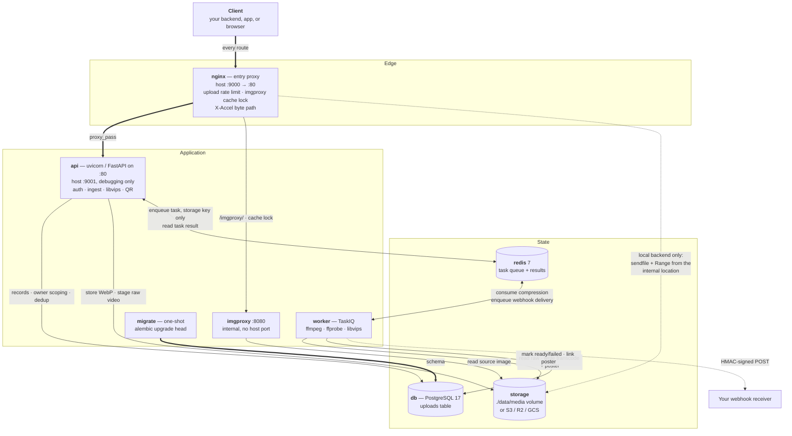
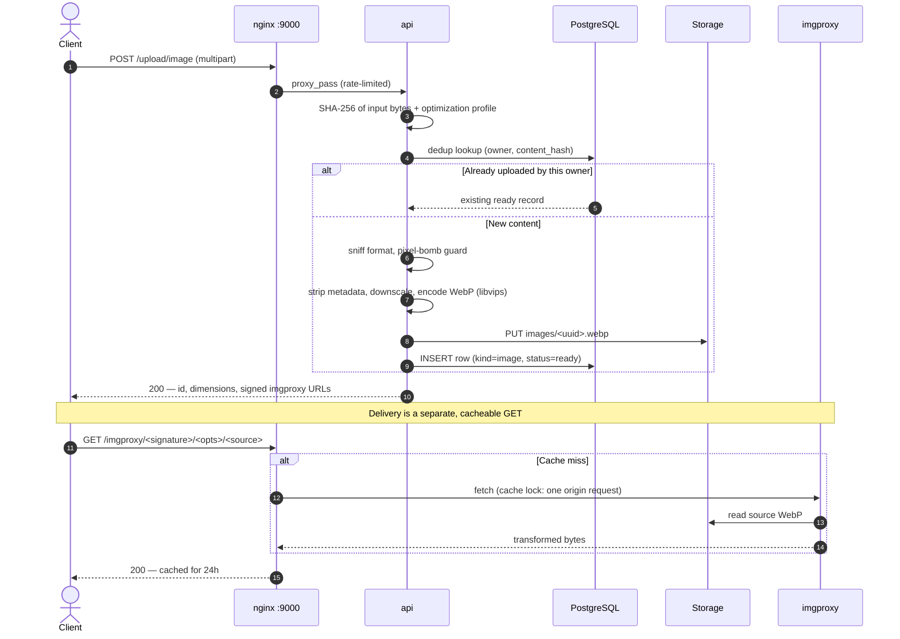
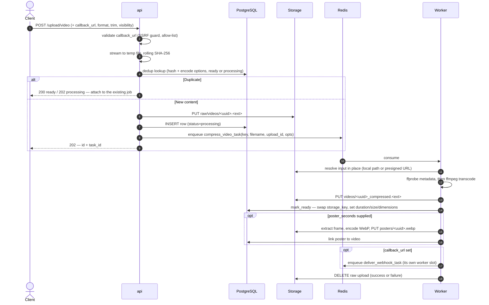
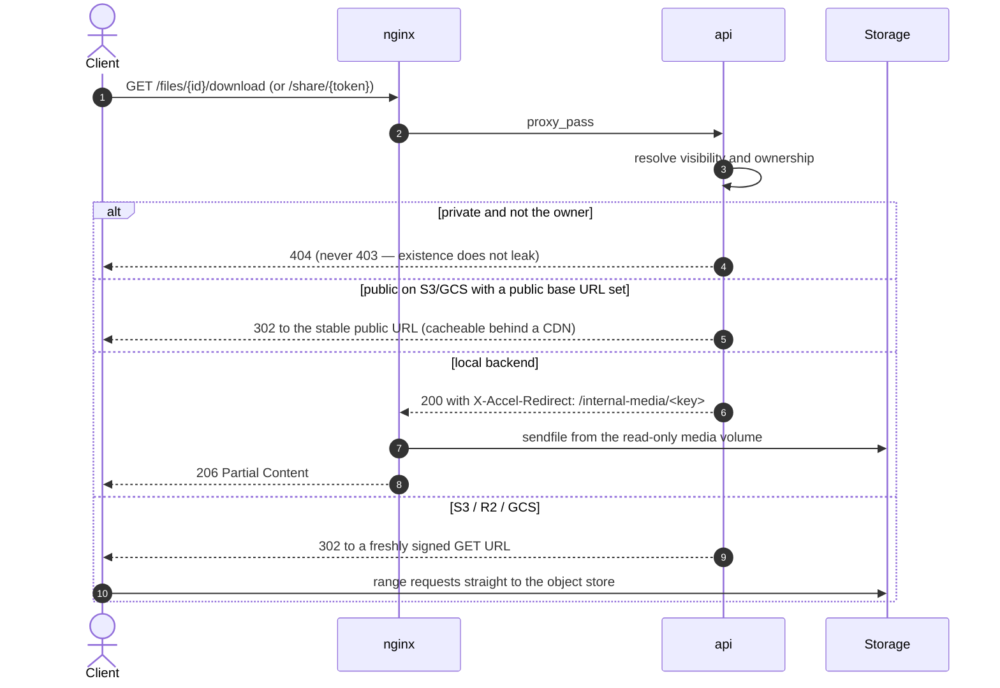

<br>
<p align="center">
  <a href="#">
    
  </a>

  <h3 align="center">Filemanager-FastAPI</h3>

  <p align="center">
    A media-processing microservice: images, video, and QR codes.
  </p>
</p>

<p align="center">
  <a href="https://github.com/JexPY/filemanager-fastapi/actions/workflows/ci.yml"></a>
  <a href="https://github.com/JexPY/filemanager-fastapi/actions/workflows/codeql.yml"></a>
  <a href="https://sonarcloud.io/summary/new_code?id=JexPY_filemanager-fastapi"></a>
  <a href="https://sonarcloud.io/summary/new_code?id=JexPY_filemanager-fastapi"></a>
  <a href="https://snyk.io/test/github/JexPY/filemanager-fastapi"></a>
  <a href="https://opensource.org/licenses/MIT"></a>
</p>

---

**Upload an image** and get back a stripped, re-encoded WebP plus signed imgproxy URLs for
on-demand resizing. **Upload a video** and get back a task id while a separate worker
transcodes it; optionally it extracts a poster frame and pushes a signed webhook when it
lands. **Generate QR codes** inline. Storage is pluggable: local disk, S3/R2/Garage, or
Google Cloud Storage.

Everything runs in Docker. `docker compose up --build` gives you the whole stack.

> Interactive API docs at `/docs` (Swagger UI) and `/redoc`.
> Deployment guidance lives in [`docs/PRODUCTION.md`](docs/PRODUCTION.md).

## Contents

**Getting started** — [Quickstart](#quickstart) · [Core concepts](#core-concepts) · [Configuration](#configuration) · [Development](#development)

**How it works** — [Architecture](#architecture) · [Request flows](#request-flows) · [Storage backends](#storage-backends)

**Reference** — [API reference](#api-reference) · [Authentication](#authentication) · [Webhooks](#webhooks) · [Limits and scope](#limits-and-scope)

---

## Quickstart

### 1. Configure

```sh
cp .env-example .env

# Generate two distinct secrets and put them in .env as IMGPROXY_KEY / IMGPROXY_SALT.
# They must match the imgproxy container's env vars exactly (compose reads the same file).
openssl rand -hex 32
openssl rand -hex 32
```

Then set at least one bearer token:

```ini
# .env — a bare `secret`, or `label:secret` for a readable audit trail
FILE_MANAGER_BEARER_TOKENS=mobile:s3cr3t-a,admin:s3cr3t-b
```

The app refuses to boot on a bad config rather than failing on the first request. A missing
bucket for the selected backend, an empty token list, a non-hex imgproxy key or salt, and an
invalid `LOCAL_MEDIA_SERVE_MODE` are all startup errors.

### 2. Run

```sh
docker compose up --build
```

The service comes up behind nginx at **`http://localhost:9000`**, with Swagger UI at
`http://localhost:9000/docs`. A one-shot `migrate` service applies the Alembic migrations
and exits before `api` and `worker` start.

> If you switch `STORAGE_BACKEND` to `s3`/`gcp`, also set the matching `*_PUBLIC_BASE_URL`
> and `IMGPROXY_ALLOWED_SOURCES`. Without a public base URL imgproxy has no address it can
> fetch an image source from, and the app logs a warning at startup saying so.

### 3. Call it

```sh
TOKEN=your-token-here
BASE=http://localhost:9000

curl $BASE/readyz     # 200 once redis, storage, and postgres are all reachable

# Image — synchronous. Returns the record id plus signed imgproxy URLs.
curl -H "Authorization: Bearer $TOKEN" -F "file=@photo.jpg" $BASE/upload/image

# Video — asynchronous. Returns 202 with a task_id and record id.
curl -H "Authorization: Bearer $TOKEN" -F "file=@clip.mp4" $BASE/upload/video

# Generic file (PDF, audio, document) — synchronous, stored immediately at status='ready'.
curl -H "Authorization: Bearer $TOKEN" -F "file=@document.pdf" $BASE/upload/file

# Poll the task for a thin status, or the record for the full state.
curl -H "Authorization: Bearer $TOKEN" $BASE/tasks/<task_id>
curl -H "Authorization: Bearer $TOKEN" $BASE/files/<id>

# List your uploads (owner-scoped — you only ever see your own).
curl -H "Authorization: Bearer $TOKEN" "$BASE/files?limit=20&kind=video"

# QR codes — returned inline as PNG, never stored.
curl -H "Authorization: Bearer $TOKEN" -F "content=https://example.com" \
  $BASE/generate/qrcode -o qr.png

curl -H "Authorization: Bearer $TOKEN" -F "ssid=MyHomeWiFi" -F "password=secret" \
  -F "logo=@logo.png" $BASE/generate/qrcode/wifi -o wifi_qr.png
```

---

## Core concepts

Four ideas explain most of the API surface.

**Owner.** Every credential resolves to an owner id, and every record belongs to one.
Listing, fetching, updating, deleting, poster generation, and task polling are all
owner-scoped, and another owner's record is a **404, never a 403**, so existence never leaks
across tenants. The exceptions are all opt-in, per record: a `public` record's download URL,
a share link, and a `read:file` grant you mint for one specific record.

**Record.** Each image and video upload writes one row you can fetch at `GET /files/{id}`.
It is the system of record — status, dimensions, duration, visibility, poster link, and
webhook delivery state all live there. QR codes are returned inline and never recorded.

> **Store the id, not the URL.** The record id is the only permanently stable handle. Every
> URL this service returns is derived from the id plus current configuration, and any of
> them can legitimately change underneath you: switching `STORAGE_BACKEND` rewrites every
> imgproxy source URL, putting a CDN in front changes the host, and a signed URL expires by
> design. A consuming app that persists `0f1c2b7a...` and re-derives URLs from
> `GET /files/{id}` survives all of that untouched; one that persists a rendered URL in its
> own database has to migrate it. `GET /files/{id}/download` is the one exception — it is
> deliberately permanent and backend-agnostic, so it is safe to embed directly.

**Kind and lifecycle.** An image is written `ready` inside the request. A video is written
`processing` *before* its task is enqueued, and the worker then flips it to `ready`
(swapping the raw storage key for the compressed one) or `failed`.

**Idempotency.** Both upload kinds dedupe per owner on a SHA-256 of the *input* bytes
combined with the processing parameters. Re-posting identical bytes with identical options
returns the existing record instead of doing the work twice; changing a parameter — a
different image `optimization`, a different video `format` or trim window — is correctly
treated as a new upload.

---

## Architecture

Two process types share one codebase, selected by which command runs. `api` serves every
HTTP route; `worker` runs FFmpeg. They are coupled only through Redis, Postgres, and the
storage backend — no shared memory, no in-process state.

nginx is the entry proxy. It rate-limits uploads, acts as an origin shield in front of
imgproxy, and — on the `local` backend — serves video bytes itself via `X-Accel-Redirect`,
keeping the Python process out of the byte path entirely.

### Container topology



Both `api` and `worker` wait on `migrate` completing (`service_completed_successfully`) and
on `db`/`redis` being healthy, so the `uploads` table always exists before either touches
it. Four more compose services are opt-in and left off the diagram: `garage` and
`garage-init` (`--profile s3-dev`), `db-backup` (`--profile backup`), and `test`
(`--profile test`).

Notes on the topology as it is actually wired:

- **imgproxy publishes no host port.** All image transforms go through
  `nginx:/imgproxy/`, which is where `proxy_cache_lock` prevents a cache stampede on the
  origin. `IMGPROXY_BASE_URL` should therefore point at nginx, not at imgproxy.
- **The api's host port 9001 is for debugging only.** Only nginx interprets
  `X-Accel-Redirect`, so local video playback does not work if you hit `:9001` directly.
- **Two nginx locations are marked `internal;`** — `/internal-media/` (the `local` media
  volume, mounted read-only into both nginx and imgproxy) and `/internal-object/` (a proxy to
  the object store for private media). Both can only be entered via an upstream
  `X-Accel-Redirect`, never by a direct client request. That is what keeps the download
  route's visibility and ownership checks from being bypassable, on every backend.
- **Uploads are rate-limited at the edge**, at 2 req/s per IP with a burst of 5, matching
  `^/upload/(images?|video)$`; over the burst is a 429. Read, list, health, and
  `/upload/presign` are unrestricted.
- **Only the storage key travels through Redis**, never the bytes — for the compression
  task and for the webhook-delivery task alike. The worker fetches the object itself, and
  reads it *in place* (a local path, or a presigned URL streamed over HTTPS).

---

## Request flows

### Image ingestion and thumbnail delivery

Images are handled synchronously. The input bytes are hashed for per-owner idempotency,
then decoded, stripped of all metadata (EXIF, GPS, ICC, XMP), downscaled if they exceed the
profile's dimension cap, and re-encoded to WebP with libvips. Clients get signed imgproxy
URLs and let imgproxy do the resizing from there.



### Asynchronous video transcoding

The upload streams straight to a temp file and is hashed as it lands, so memory stays
bounded regardless of file size. The record is written as `processing` **before** the task
is enqueued, so the worker can never observe a task whose row does not exist yet.



If the owner deletes the upload mid-transcode, `mark_ready` finds no row and the worker
discards the object it just wrote rather than orphaning it. On any failure the row is marked
`failed`, a `video.failed` webhook is enqueued, and the error is re-raised so
`GET /tasks/{id}` reports it too.

### Playback

`GET /files/{id}/download` is the permanent, backend-agnostic URL clients embed. It never
proxies bytes — it either hands nginx an internal redirect or 302s to a signed object-store
URL. HTTP Range works on every path.



A **share token** is a separate capability: `POST /files/{id}/share` mints a
`secrets.token_urlsafe(32)` and is the only response that ever returns it. It is excluded
from every record view, so it cannot leak through listings, webhooks, or their logs.
`GET /share/{token}` then serves the video regardless of visibility, with no bearer token.

---

## API reference

Every route that takes a `{id}` resolves it **scoped to your own records** — another
owner's id is a `404`, never a `403`. The exceptions are deliberate and per record: a
`public` record's `GET /files/{id}/download`, a `read:file` grant bound to one id, and
`GET /share/{token}`.

### Uploads

| Method | Endpoint | Auth | Notes |
|---|---|---|---|
| `POST` | `/upload/image` | `upload:image` | Synchronous. Strips metadata, encodes WebP, returns signed imgproxy URLs. Idempotent per owner. |
| `POST` | `/upload/images` | `upload:image` | Bulk, max 10 files / 50 MB total, 4 processed concurrently. Failed items are skipped, not fatal — check `count`. |
| `POST` | `/upload/video` | `upload:video` | Streams to disk, stages, enqueues transcode. `202`, or `200`/`202` on a duplicate. |
| `POST` | `/upload/presign` | master token only | Mints a short-lived capability JWT and a ready-to-use upload URL. `503` if `JWT_SECRET_KEY` is unset. |

**Image form fields.** `file`, `optimization`, `imgproxy_width`, `imgproxy_height`,
`imgproxy_fit` (`auto`\|`fit`\|`fill`\|`fill-down`\|`force`), `imgproxy_format`
(`webp`\|`png`\|`jpg`\|`jpeg`\|`avif`\|`gif`). Supplying any custom transform parameter adds
an `imgproxy_custom_url` to the response alongside the always-present
`imgproxy_thumbnail_url`. Materialized 300×300 thumbnail renditions are generated in the same
libvips pass and persisted under derived keys (`images/<uuid>_t300.webp`).

Accepted image inputs are **PNG, JPEG, GIF, WebP, and HEIC**, detected by magic bytes before
libvips touches the buffer. **SVG is deliberately rejected** — libvips here is built with
librsvg, so accepting markup would be an XXE / entity-expansion / SSRF vector.

`optimization` controls both WebP quality and a maximum stored dimension. Images larger than
the cap are downscaled at upload time; imgproxy resizes down from whatever is stored, never
up:

| Profile | WebP quality | Max dimension |
|---|---|---|
| `size` | 65 | 1280 px |
| `balanced` (default) | 85 | 1920 px |
| `quality` | 95 | 3840 px |

**Video form fields:**

| Field | Values | Meaning |
|---|---|---|
| `format` | `mp4` (default), `webm_vp9`, `webm_av1` | Output container and codec pair. |
| `optimization` | `balanced` (default), `quality` | `balanced` caps width at 1280; `quality` at 1920. |
| `start_seconds` / `end_seconds` | float | Trim the source before encoding. |
| `poster_seconds` | float | Extract a poster frame automatically at this timestamp. |
| `visibility` | `public` (default), `private` | Access model for the record. Also accepted on image uploads. |
| `callback_url` | https URL | Webhook target. Validated at upload time; `400` if webhooks are off or the host is not allow-listed. |

> **`visibility` defaults to `public`** on both image and video uploads. A public record's
> `/files/{id}/download` URL is fetchable by anyone who has the id, with no token. Pass
> `visibility=private` at upload, or `PATCH /files/{id}` afterwards, to restrict it to the
> owner and to `read:file` grants you mint.

Accepted video content types: `video/mp4`, `video/webm`, `video/quicktime`,
`video/x-matroska`, `video/x-msvideo`, `video/mpeg`, `video/ogg`, `video/3gpp`, plus
`application/octet-stream` as a fallback for browsers that send nothing better. Anything
else is a `400` before a single byte is staged.

Codecs per format: `mp4` uses libx264 + AAC with `+faststart`; `webm_vp9` uses libvpx-vp9 +
Opus; `webm_av1` uses SVT-AV1 + Opus.

> **Output is capped at 60 seconds by default.** `VIDEO_MAX_DURATION_SECONDS` is an ffmpeg
> `-t` limit on the encode, so a longer upload is accepted and transcoded but comes back
> trimmed. This is not silent: the record reports `duration_seconds` (the source's real
> length) and `truncated: true`. Raise or disable it (`0` removes the cap) if you are
> handling full-length media, and widen `FFMPEG_TIMEOUT_SECONDS` to match.

### The record

`GET /files/{id}` returns the full record. The URL fields appear only once `status` is
`ready`; `share_token` is never included.

**`url` is the canonical address and has the same shape for every kind** — the
`/files/{id}/download` route. It is permanent and backend-agnostic: switching
`STORAGE_BACKEND`, moving behind a CDN, or flipping visibility all leave it untouched, and
it is the only URL here that resolves for a `private` record.

The rest are **accelerators, present only on `public` records**, because each is an
unexpiring URL with no ownership check:

| Field | What it is | When present |
|---|---|---|
| `direct_url` | The object's public/CDN URL — no redirect hop, no imgproxy | public, on `s3`/`gcp` with a `*_PUBLIC_BASE_URL` |
| `thumbnail_url` | Direct CDN/object URL of the materialized 300×300 thumbnail (or signed imgproxy URL) | public images |
| `poster_url` | Signed imgproxy URL for a video's poster | public records with a poster |

```json
{
  "id": "0f1c2b7a5e4d4a9c8f2b1d6e3a7c0b95",
  "kind": "video",
  "status": "ready",
  "content_type": "video/mp4",
  "size_bytes": 4185302,
  "width": 1280,
  "height": 720,
  "task_id": "b2e1d4c8-...",
  "original_filename": "clip.mov",
  "duration_seconds": 92.4,
  "truncated": true,
  "callback_url": "https://hooks.example.com/media",
  "poster_upload_id": "7a3d9e18c4b24f5aa1e0d7c6b93f2481",
  "webhook_status": "delivered",
  "webhook_attempts": 1,
  "webhook_last_error": null,
  "webhook_updated_at": "2026-08-15T09:12:44+00:00",
  "visibility": "public",
  "url": "https://media.example.com/files/0f1c2b7a.../download",
  "direct_url": "https://cdn.example.com/videos/0f1c2b7a..._compressed.mp4",
  "poster_url": "https://media.example.com/imgproxy/<sig>/rs:auto/<src>",
  "created_at": "2026-08-15T09:11:02+00:00",
  "updated_at": "2026-08-15T09:12:40+00:00"
}
```

`GET /files` wraps a page of these as
`{"files": [...], "total_count": N, "limit": L, "offset": O}` — `total_count` is the owner's
full match count, so a client can size its pager without walking every page.

### Files, playback, and sharing

| Method | Endpoint | Auth | Notes |
|---|---|---|---|
| `GET` | `/files` | bearer | Newest first. Query: `limit` (1–200, default 50), `offset`, `kind` (`image`\|`video`). |
| `GET` | `/files/{id}` | bearer | Full record. Poll this for `status`, `poster_upload_id`, and webhook state. |
| `PATCH` | `/files/{id}` | bearer | JSON body `{"visibility": "public"}` or `{"visibility": "private"}`. Any kind. Going private rotates the storage key (see below). |
| `DELETE` | `/files/{id}` | bearer | Deletes the object first, then the row. Cascades to the video's poster. `204`. |
| `GET` | `/files/{id}/download` | none if `public`; else owner or a `read:file` grant | The canonical URL for any kind. Range on every backend. |
| `POST` | `/files/{id}/share` | bearer | Mints or rotates the share token; the only response that returns it. Any kind. |
| `DELETE` | `/files/{id}/share` | bearer | Revokes it. Idempotent, `204`. |
| `GET` | `/share/{token}` | none | Serves the record regardless of kind or visibility; the token is the grant. Unknown or revoked is a `404`. |
| `POST` | `/files/{id}/poster` | bearer | On-demand poster from a *ready* video. `202` when enqueued, `200` with the poster record if one already exists, `409` if the video is not ready. |
| `POST` | `/files/{id}/redeliver` | bearer | Replays a webhook with the same idempotency id. `400` if webhooks are off or the record has no `callback_url`, `409` while still processing. |

`POST /files/{id}/poster` takes an optional `at_seconds` **form field** (multipart, not
JSON); the default is roughly 10% into the clip, chosen so the frame is not a black lead-in.
The `202` response carries a `poll` URL — poll `GET /files/{id}` until `poster_upload_id` is
set, then fetch that id for the image record.

Deleting is explicit and irreversible, and the object is removed before the row — so a
transient storage failure leaves the record intact and retryable rather than stranding an
object with no record.

**Turning a record private rotates its storage key.** The object and any materialized
renditions are copied to fresh UUID keys, the row is re-pointed, and the old objects are deleted.
That is what actually invalidates access rather than merely withdrawing it: while the record was
public its URL may have been cached by a CDN and embedded in already-rendered HTML, neither of
which can be recalled. Rotating kills all of them at once — the object URLs change, and since an
imgproxy URL signs its source, every rendition URL changes with it. A video's poster is cascaded
the same way, since it is a separate record with its own public URLs. The copy is server-side on
`s3`/`gcp` (and `shutil` on `local`), so the bytes never move through this process. Going *public*
does not rotate — there is nothing cached to invalidate. Materialized renditions for private or
shared media can be addressed via `/files/{id}/download?rendition=thumb` (with owner auth or a bound
`read:file` token) and `/share/{token}?rendition=thumb`.

### Tasks, QR codes, and system

| Method | Endpoint | Auth | Notes |
|---|---|---|---|
| `GET` | `/tasks/{task_id}` | bearer | `pending` \| `completed` \| `failed`, for a **video compression** task id. Owner-scoped via the record, so an unknown id is a `404`. |
| `POST` | `/generate/qrcode` | bearer | Plain text or URL. |
| `POST` | `/generate/qrcode/wifi` | bearer | `ssid`, `password`, `security` (`WPA`\|`WEP`\|`nopass`), `hidden`. |
| `POST` | `/generate/qrcode/vcard` | bearer | vCard 3.0 contact card. |
| `POST` | `/generate/qrcode/mecard` | bearer | Compact MeCard contact. |
| `POST` | `/generate/qrcode/geo` | bearer | Latitude / longitude. |
| `POST` | `/generate/qrcode/epc` | bearer | SEPA EPC payment (IBAN format validated). |
| `GET` | `/healthz` | none | Liveness. Always 200 if the process is serving. |
| `GET` | `/readyz` | none | Readiness. 200 only if Redis, storage, and Postgres are all reachable; 503 otherwise, with a per-dependency breakdown. |

`/tasks/{task_id}` resolves the id through the `uploads` row it was recorded on, which is
only done for video compression. The `task_id` returned by `POST /files/{id}/poster` and
`POST /files/{id}/redeliver` is an internal handle for logs and correlation — polling it
here returns `404`. Track those through `GET /files/{id}` (`poster_upload_id`,
`webhook_status`) instead.

The task result itself is deliberately thin — `{"status": "success", "upload_id": "..."}`.
Duration, truncation, dimensions, poster link, and webhook state live on the record, not the
task, so read `GET /files/{id}` for anything substantive.

All QR routes return a PNG inline, accept an optional `logo` overlay (PNG, JPEG, GIF, WebP,
or HEIC — not SVG) and a `scale` (1–20), and store nothing. There is no record to fetch
afterwards.

### Status codes

Error bodies are always sanitized: the real exception is logged server-side and never echoed
to the client.

| Code | When |
|---|---|
| `400` | Unsupported or corrupt input, a poster requested for a non-video, a rejected `callback_url`, a malformed QR field. |
| `401` | Missing, invalid, or expired credential. No hint as to which. |
| `403` | A capability JWT lacking the required upload scope, a `read:file` token on an owner-scoped route, or a JWT presented to `/upload/presign`. |
| `404` | Unknown id, another owner's record, a private record without a valid credential for it, an unknown or revoked share token, a non-compression task id. |
| `409` | Poster requested for a video that is not `ready`; redelivery while still processing. |
| `413` | Upload over `MAX_IMAGE_UPLOAD_BYTES` / `MAX_VIDEO_UPLOAD_BYTES` / `MAX_QR_LOGO_BYTES`, or over nginx's `client_max_body_size` before that. |
| `422` | Malformed query, body, or form field (FastAPI validation) — including QR content over `MAX_QR_CONTENT_LENGTH`. |
| `429` | nginx upload rate limit exceeded. |
| `499` | Client disconnected mid-upload. Nothing is staged, no record is written, and the partial temp file is discarded. |
| `502` | Storage or metadata backend unavailable. Fail-closed and visible. |
| `503` | `/upload/presign` without `JWT_SECRET_KEY`; `/readyz` with a dependency down. |

`499` is nginx's non-standard "client closed request" code, kept here so an abandoned upload
stays distinguishable from a real client or server error in logs and metrics.

Every response carries an `X-Request-ID` (echoed from the request if you send one, else
generated). Logs are structured JSON — including uvicorn's access lines — and carry the same
id, so one request's lines can be grepped together across the api.

---

## Authentication

Two credential shapes resolve to the same owner identity.

**Static master tokens** — the entries in `FILE_MANAGER_BEARER_TOKENS`, compared in constant
time. Unrestricted: they bypass every scope check. Each entry is either a bare `secret`
(owner derived as `tok_<hash>`, so the secret is never stored in records) or `label:secret`
(owner = `label`, for a readable audit trail). The client always sends just the secret.

> Treat a master token as a backend-to-backend secret. Whoever holds one has full read,
> write, and delete access to everything under that token's owner. See
> [`docs/PRODUCTION.md`](docs/PRODUCTION.md) for the intended integration pattern.

**Capability JWTs** — short-lived HS256 tokens signed with `JWT_SECRET_KEY`, carrying `sub`
(owner), `exp` (strictly enforced), and `scopes`. A bad, expired, or mis-signed token is a
flat `401` with no explanation of why.

| Scope | Grants |
|---|---|
| `upload:image` | `POST /upload/image`, `POST /upload/images`. Also acts as its `sub` on the owner-scoped routes, like a static token. |
| `upload:video` | `POST /upload/video`. Same owner-equivalence. |
| `read:file` | Read **one** record via `GET /files/{id}/download`. Nothing else. |

`read:file` is the credential your service mints for an end user *after* running its own
permission check, so it can fetch one private file directly. It requires a `file` claim
naming the record — a `read:file` token without one is rejected outright rather than treated
as a broader grant — and it is deliberately **not** owner-equivalent: presenting one to any
owner-scoped route (`GET /files`, `DELETE`, share minting) is a `403`. Otherwise handing a
user one file would hand them the whole tenant.

Your backend can sign these itself with the shared `JWT_SECRET_KEY`; there is no mint
endpoint to call.

```json
{ "sub": "tenant-42", "scopes": ["read:file"], "file": "0f1c2b7a...", "exp": 1760000300 }
```

JWT auth is off unless `JWT_SECRET_KEY` is set. Leave it blank and only static tokens are
accepted — the original behavior — and `/upload/presign` returns `503`.

Either shape may ride the `Authorization: Bearer` header **or** a `?token=` query parameter,
with identical validation. The query form exists for clients that cannot set headers — a
plain `<form>` POST, or a `<video src>` pointing at a private download URL.
(`/upload/presign` is the one exception: it reads the header only.)

### Direct browser uploads

`/upload/presign` lets a trusted backend hand an untrusted frontend a scoped, expiring
upload URL, so file bytes never round-trip your main backend. It requires a static master
token, which means a leaked JWT can never mint more JWTs.

```sh
curl -X POST -H "Authorization: Bearer $MASTER_TOKEN" \
  -H "Content-Type: application/json" \
  -d '{"kind":"image","owner_id":"tenant-42","expires_in_seconds":300}' \
  $BASE/upload/presign
# -> { "url": "https://media.example.com/upload/image?token=<jwt>",
#      "token": "<jwt>", "expires_at": 1760000000, "scope": "upload:image" }
```

`expires_in_seconds` accepts 1–86400 and defaults to 300. The returned `url` is absolute
only when `PUBLIC_BASE_URL` is set; otherwise it is a relative path for the client to prefix.

---

## Storage backends

Selected with `STORAGE_BACKEND`. The choice changes both how imgproxy reaches source images
and how video bytes are delivered.

| | `local` | `s3` (S3 / R2 / Garage) | `gcp` |
|---|---|---|---|
| Objects live in | `LOCAL_STORAGE_DIR` volume | `S3_BUCKET` | `GCS_BUCKET` |
| imgproxy source | `local://` on a shared read-only mount | presigned or public URL | presigned or public URL |
| Public byte path | nginx `X-Accel-Redirect` (sendfile + Range) | 302 to the public/CDN URL | 302 to the public/CDN URL |
| Private byte path | nginx `X-Accel-Redirect` | nginx proxies a signed URL the client never sees | same |
| Public video URL | not applicable — always served through nginx | 302 to `S3_PUBLIC_BASE_URL` when set | 302 to `GCS_PUBLIC_BASE_URL` when set |
| Worker ffmpeg input | the file's path, read in place | presigned URL, streamed over HTTPS | presigned URL, streamed over HTTPS |
| Verified | end to end | end to end against Garage | unit-tested with a mocked client only |

The three `*_PUBLIC_BASE_URL` settings are independent on purpose, so switching backends
cannot silently reuse a URL configured for a different one. Putting a CDN in front is a
deploy concern with no code change: point the relevant `*_PUBLIC_BASE_URL` at the CDN domain.

Storage keys are `images/<uuid>.webp`, `raw/videos/<uuid>.<ext>`,
`videos/<uuid>_compressed.<ext>`, and `posters/<uuid>.webp`. A client-supplied filename never
reaches a key unsanitized — only its extension survives, lowercased and reduced to at most 8
characters of `[a-z0-9]`.

Run against a local S3-compatible server. The fixture is [Garage](https://garagehq.deuxfleurs.fr/)
(pinned to `dxflrs/garage:v2.3.0`), which replaced MinIO after that project was archived in
April 2026. It boots with `--single-node --default-bucket`, so the cluster layout, the
bucket, and the credentials are all provisioned before the S3 API starts listening;
`garage-init` is a one-shot readiness gate that exits once the cluster reports healthy.

```sh
docker compose --profile s3-dev up -d --wait garage garage-init
# then in .env:
#   STORAGE_BACKEND=s3
#   S3_BUCKET=filemanager-test
#   S3_ENDPOINT_URL=http://garage:3900
#   AWS_REGION=garage
#   AWS_ACCESS_KEY_ID=garageadmin
#   AWS_SECRET_ACCESS_KEY=garageadminsecretkey
```

`AWS_REGION` must match Garage's configured `s3_region`, because SigV4 binds the region into
the credential scope. The S3 API is on host port 9002 and Garage's admin/health API on 9003
(the ports MinIO used), clear of nginx on 9000 and the api's debug port on 9001.

The `s3_integration`-marked tests in `tests/test_storage_s3_integration.py` run against this
fixture and cover what client-side signing tests cannot: a real multipart upload, a presigned
GET that is actually fetched, and a Range request returning 206. They skip when no endpoint is
reachable; set `S3_INTEGRATION_REQUIRED=1` (CI does) to make that a failure instead.

---

## Webhooks

Pass `callback_url` on `POST /upload/video` and the service POSTs a signed payload when
transcoding reaches a terminal state (`video.completed` or `video.failed`).

Webhooks are **off unless both `WEBHOOK_SIGNING_SECRET` and `WEBHOOK_ALLOWED_HOSTS` are
set**; with them unset, any `callback_url` is rejected with a `400`.

The URL is admitted at upload time, before anything is staged: https-only unless
`WEBHOOK_ALLOW_INSECURE_HTTP`, the host must be on the explicit allow-list, and unless
`WEBHOOK_ALLOW_PRIVATE_IPS` it must not resolve to a private, loopback, link-local,
reserved, multicast, or unspecified address. The allow-list is the authoritative egress
control; the IP check is defence in depth.

Delivery runs on its own task, so a slow receiver ties up a delivery slot rather than a
transcoding slot.

### Payload

The body is compact JSON with sorted keys — sign and verify the **raw bytes**, not a
re-serialization. `data` is the same record shape `GET /files/{id}` returns.

```json
{
  "id": "0f1c2b7a5e4d4a9c8f2b1d6e3a7c0b95",
  "event": "video.completed",
  "created_at": "2026-08-15T09:12:44.512331+00:00",
  "data": { "...": "the full record" }
}
```

### Headers

| Header | Value |
|---|---|
| `X-Webhook-Id` | The upload id — stable across retries and redeliveries, so receivers can dedupe |
| `X-Webhook-Event` | `video.completed` or `video.failed` |
| `X-Webhook-Timestamp` | Unix seconds; part of the signed material, so you need it to verify |
| `X-Webhook-Signature` | `sha256=<hex>` — HMAC-SHA256 over `<timestamp>.<raw body>`, keyed with `WEBHOOK_SIGNING_SECRET` |
| `User-Agent` | `filemanager-fastapi-webhooks/1` |

```python
import hashlib
import hmac


def verify(raw_body: bytes, timestamp: str, signature: str, secret: str) -> bool:
    digest = hmac.new(
        secret.encode(), f"{timestamp}.".encode() + raw_body, hashlib.sha256
    ).hexdigest()
    return hmac.compare_digest(f"sha256={digest}", signature)
```

Signing over `timestamp.body` means a captured body cannot be replayed under a fresh
timestamp. Reject stale timestamps on your side to close the replay window.

### Failure handling

Failed deliveries retry with exponential backoff — `WEBHOOK_RETRY_BACKOFF_SECONDS * 2^(n-1)`,
capped at 30 s per wait — up to `WEBHOOK_MAX_ATTEMPTS`. An exhausted delivery is a durable
dead-letter record on the row (`webhook_status`, `webhook_attempts`, `webhook_last_error`),
not just a log line — replay it with `POST /files/{id}/redeliver`, which re-sends the current
terminal event under the same `X-Webhook-Id`.

---

## Configuration

[`.env-example`](.env-example) is the annotated starting point. The tables below are the
full reference; anything not listed in `.env-example` still works as an environment
variable, it just isn't pre-seeded there.

### Core

| Variable | Default | Purpose |
|---|---|---|
| `FILE_MANAGER_BEARER_TOKENS` | — | Comma-separated `secret` or `label:secret`. **Required**; empty fails startup. |
| `STORAGE_BACKEND` | `local` | `local` \| `s3` \| `gcp`. |
| `DATABASE_URL` | — | Postgres DSN for the metadata store. Set by compose for the bundled `db`. |
| `REDIS_URL` | `redis://redis:6379/0` | TaskIQ broker and result backend. |
| `PUBLIC_BASE_URL` | — | This service's external origin. Makes share/download/presign URLs absolute; blank returns relative paths. |

### Storage

| Variable | Default | Purpose |
|---|---|---|
| `LOCAL_STORAGE_DIR` | `/data/media` | Root of the `local` backend's volume, shared read-only with nginx and imgproxy. |
| `LOCAL_PUBLIC_BASE_URL` | — | Base URL prepended to local object keys. Not used for video playback (that always goes through nginx). |
| `S3_BUCKET` | — | **Required** when `STORAGE_BACKEND=s3`. |
| `S3_ENDPOINT_URL` | — | Custom endpoint for R2 / Garage; blank for real AWS. |
| `S3_PUBLIC_BASE_URL` | — | CDN or custom domain in front of the bucket. Enables the stable 302 for `public` videos. |
| `AWS_REGION` | — | Region for real AWS S3. |
| `AWS_ACCESS_KEY_ID` / `AWS_SECRET_ACCESS_KEY` | — | Blank falls back to boto's default credential chain (IAM roles, env). |
| `GCS_BUCKET` | — | **Required** when `STORAGE_BACKEND=gcp`. |
| `GCS_PUBLIC_BASE_URL` | — | CDN or custom domain in front of the bucket. |
| `GCP_PROJECT` / `GCP_SERVICE_ACCOUNT_FILE` | — | Service-account credentials; the key file is also what signs V4 playback URLs locally. |

### imgproxy and nginx

| Variable | Default | Purpose |
|---|---|---|
| `IMGPROXY_KEY` / `IMGPROXY_SALT` | — | Hex-encoded, should differ, must match the imgproxy container exactly. **Required.** |
| `IMGPROXY_BASE_URL` | — | Where imgproxy is reachable. Point at nginx, e.g. `http://localhost:9000/imgproxy`. |
| `IMGPROXY_ALLOWED_SOURCES` | `local://` | Egress allow-list for imgproxy. On `s3`/`gcp` set it to your public/CDN prefix. |
| `ENABLE_IMGPROXY_CACHE` | `true` | Toggles the nginx origin-shield cache. |
| `NGINX_MAX_BODY_SIZE` | `2000m` | Edge body cap. Keep at or above `MAX_VIDEO_UPLOAD_BYTES` or nginx 413s before the app's own check. |

### Limits

| Variable | Default | Purpose |
|---|---|---|
| `MAX_IMAGE_UPLOAD_BYTES` | 25 MiB | Per-image cap. |
| `MAX_VIDEO_UPLOAD_BYTES` | 2000 MiB | Per-video cap, enforced while streaming to disk. |
| `MAX_IMAGE_PIXELS` | 50,000,000 | Decompression-bomb guard, checked from the header before any full-resolution decode. |
| `MAX_QR_CONTENT_LENGTH` | 2000 | Rejects oversized QR payloads before they reach segno. |
| `MAX_QR_LOGO_BYTES` | 5 MiB | Logo overlay cap. |

### Video pipeline

| Variable | Default | Purpose |
|---|---|---|
| `VIDEO_MAX_DURATION_SECONDS` | 60 | Caps compressed output duration (ffmpeg `-t`). Longer inputs are trimmed and flagged `truncated`. `0` disables the cap. |
| `FFMPEG_TIMEOUT_SECONDS` | 120 | Wall-clock kill for a wedged transcode. |
| `FFPROBE_TIMEOUT_SECONDS` | 15 | Separate, much shorter budget for the metadata probe. |
| `FFMPEG_INPUT_URL_TTL_SECONDS` | 3600 | TTL of the presigned URL the worker hands ffmpeg as input on s3/gcp. Must exceed the ffmpeg timeout. |
| `VIDEO_PLAYBACK_URL_TTL_SECONDS` | 21600 | TTL of the signed playback URL. Size it to a viewing session. |
| `LOCAL_MEDIA_SERVE_MODE` | `xaccel` | `xaccel` for production (nginx serves bytes) or `direct` for a no-nginx dev setup. |
| `PRIVATE_MEDIA_SERVE_MODE` | `stream` | How private media is served on `s3`/`gcp`. `stream` proxies the bytes through nginx so no signed URL ever reaches the client; `redirect` 302s to a signed URL instead, keeping bandwidth off this host at the cost of a leakable, expiring URL. |

### Optional features

| Variable | Default | Purpose |
|---|---|---|
| `JWT_SECRET_KEY` | — | Enables capability JWTs and `/upload/presign`. Blank means static tokens only. |
| `JWT_ALGORITHM` | `HS256` | Signing algorithm for the above. |
| `WEBHOOK_SIGNING_SECRET` | — | HMAC key. Required (with the allow-list) to enable webhooks. |
| `WEBHOOK_ALLOWED_HOSTS` | — | Comma-separated allow-list of callback hosts. |
| `WEBHOOK_ALLOW_INSECURE_HTTP` | `false` | Permit `http://` callbacks. |
| `WEBHOOK_ALLOW_PRIVATE_IPS` | `false` | Permit callbacks resolving to private or loopback addresses. |
| `WEBHOOK_TIMEOUT_SECONDS` | `10` | Per-attempt HTTP timeout. |
| `WEBHOOK_MAX_ATTEMPTS` | `4` | Attempts before dead-lettering. |
| `WEBHOOK_RETRY_BACKOFF_SECONDS` | `1.0` | Exponential backoff base, capped at 30 s per wait. |

---

## Development

Everything runs inside Docker. There is no supported local Python environment — unresolved
imports in your editor are expected noise, not a problem to fix.

```sh
docker compose up --build          # full stack
docker compose up worker           # worker only (starts its redis/db/migrate deps too)
```

> **Always pass `--build` to the `test` service.** Its image bakes the source in at build
> time rather than bind-mounting it, so `run` without `--build` silently re-runs your
> previous code.

```sh
docker compose run --rm --build test pytest -v
docker compose run --rm --build test ruff check .
docker compose run --rm --build test ruff format --check .
docker compose run --rm --build test mypy app

# Skip the tests that need live Postgres:
docker compose run --rm --build test pytest -m "not pg_integration"
```

Note `ruff format --check` rather than a bare `ruff format`: the container has its own
baked-in copy of the source, so a rewrite there is discarded with the container and never
reaches your working tree. Use `--check` to find the offending files, then fix them in your
editor.

The same four commands run in CI on every push and pull request to `master`
([`.github/workflows/ci.yml`](.github/workflows/ci.yml)), against the identical compose
service — plus CodeQL, Snyk, Trivy, Pysa, and SonarCloud workflows alongside it.

### Migrations

Alembic owns the `uploads` schema; revisions live in `migrations/`. There is no ORM model
layer, so revisions are hand-written rather than autogenerated.

```sh
docker compose run --rm migrate                        # upgrade head (the default)
docker compose run --rm migrate alembic current        # show the applied revision
docker compose run --rm migrate alembic downgrade -1   # roll back one
docker compose run --rm migrate alembic revision -m "add whatever column"
```

### Backups

```sh
docker compose --profile backup run --rm db-backup     # pg_dump, pruning dumps older than 7 days
```

### A note on the compose override

`docker-compose.override.yml` is checked in and dev-only. Compose merges it automatically
into any bare `docker compose` command from this directory, and it unconditionally replaces
the `api` and `worker` commands with single-process reload variants plus a live-mount of
`./app`. A production-facing change to `Dockerfile.api`'s `CMD` is real in the built image
but invisible under a default local `up`. To verify one, inspect the running container or run
`docker compose -f docker-compose.yml up` to exclude the override.

---

## Limits and scope

Deliberate boundaries, stated plainly rather than discovered later:

- **Not a general file host.** No cross-owner listing, no search, no public index. Deletion
  is explicit and irreversible.
- **Generic file ingest (`POST /upload/file`)** admits an allow-list of safe formats (PDF, audio, documents, and archives)
  with strict magic-byte verification and parameter stripping, storing them immediately as `ready` rows without a processing
  pipeline. Optional per-kind derivations (e.g. first-page PDF preview) would land as linked image
  records, matching how video posters work.
- **Progressive playback only.** HTTP Range works everywhere; HLS and adaptive bitrate are
  out of scope.
- **Video output is trimmed to `VIDEO_MAX_DURATION_SECONDS` (60 s by default).** The service
  is built around short-form media; long-form needs that cap raised or disabled, and the
  `FFMPEG_TIMEOUT_SECONDS` budget widened to match.
- **Images are downscaled and stripped on upload.** All metadata (EXIF, GPS, ICC profile,
  XMP) is dropped on every re-encode, and anything above the profile's dimension cap is
  resized. Neither is configurable per request beyond choosing `optimization`.
- **Image uploads are fully buffered in memory** by design, bounded by
  `MAX_IMAGE_UPLOAD_BYTES`. Video upload and worker processing stream to and from disk with
  bounded memory on every backend.
- **imgproxy needs a fetchable source.** Its URLs embed the object's *plain* public URL,
  never a presigned one — an imgproxy signature does not expire, so a presigned source would
  produce a URL that looks permanent and quietly dies. The consequence is that imgproxy
  renditions require a public bucket or a CDN in front of it (`*_PUBLIC_BASE_URL`), and are
  therefore offered only for `public` records. A private record is reachable solely through
  `GET /files/{id}/download`.
- **Dedup is best-effort.** Two genuinely simultaneous identical uploads can both slip
  through; there is no unique constraint behind it. The same is true of two simultaneous
  poster requests, where the loser becomes a harmless standalone image row.
- **Scopes are coarse.** `upload:image`, `upload:video`, and the per-file `read:file` are the
  entire taxonomy. The upload scopes are owner-equivalent everywhere else, so there is still
  no read-only-listing or admin role.
- **Only compression tasks are pollable.** Poster generation and webhook delivery run as
  their own tasks but are observed through the record, not `GET /tasks/{id}`.
- **Webhook replay is manual.** Dead-lettered deliveries are durable and replayable, but
  nothing re-attempts them on a schedule, and the delivery task waits out its full retry
  budget inline on a worker slot.
- **`PRIVATE_MEDIA_SERVE_MODE=redirect` reintroduces an expiring URL.** In the default
  `stream` mode there is no client-visible signed URL at all, so nothing expires mid-seek and
  nothing is leakable. Opting into `redirect` trades that back for keeping bandwidth off the
  host: the URL becomes a bearer token for its TTL, and a seek after
  `VIDEO_PLAYBACK_URL_TTL_SECONDS` can hit an expired signature.
- **No presigned direct-to-storage uploads.** `/upload/presign` moves the *auth* off your
  backend, but every byte still proxies through `api`.
- **No per-owner quotas.** nginx rate-limits uploads per IP and bulk image processing is
  bounded at 4 concurrent, but there are no persistent tenant storage quotas or global worker
  concurrency caps.
- **No retries or circuit breakers** around Redis, S3/GCS, imgproxy, or Postgres. Failures are
  fail-closed and visible (a generic `502`), which is correct but is not a resilience layer.
- **TLS is not shipped.** nginx terminates plain HTTP. Add a TLS terminator or an upstream
  load balancer / ingress for production.

---

## A note on v1

This started as a handwritten side project — no LLM assistance, just curiosity and a need for
a file-management microservice that did what I wanted. That original version lives on the
[`before_llm`](https://github.com/JexPY/filemanager-fastapi/tree/before_llm) branch as a
snapshot of where it began: Pillow-SIMD, libcloud, a rougher but honest codebase. Worth a
look if you are curious about the evolution.

The current version is a full rewrite with a hardened architecture and async-first internals,
but the spirit is the same.

---

## License

MIT — see [`LICENSE.txt`](LICENSE.txt).

Security issues: see [`SECURITY.md`](SECURITY.md). PRs welcome; if something is broken or
confusing, open an issue.
