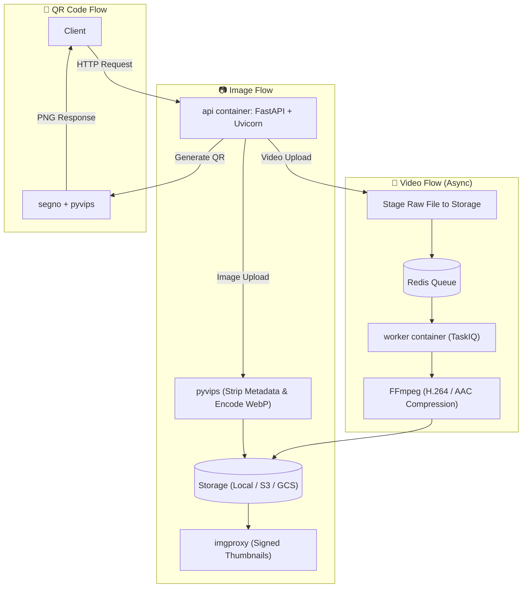

<br>
<p align="center">
  <a href="#">
    
  </a>

  <h3 align="center">Filemanager-FastAPI</h3>

  <p align="center">
    Blazing fast media microservice using FastAPI.
  </p>
</p>

<p align="center">
  <a href="https://github.com/JexPY/filemanager-fastapi/actions/workflows/ci.yml"></a>
  <a href="https://github.com/JexPY/filemanager-fastapi/actions/workflows/codeql.yml"></a>
  <a href="https://sonarcloud.io/summary/new_code?id=JexPY_filemanager-fastapi"></a>
  <a href="https://sonarcloud.io/summary/new_code?id=JexPY_filemanager-fastapi"></a>
  <a href="https://snyk.io/test/github/JexPY/filemanager-fastapi"></a>
  <a href="https://opensource.org/licenses/MIT"></a>
</p>

---

A media-processing microservice built with FastAPI. Upload images and videos, get back
optimized WebP thumbnails via imgproxy and async H.264/AAC-compressed MP4s. Also generates
QR codes. Storage is pluggable — local disk, S3/R2/MinIO, or Google Cloud Storage.

> 📖 **Full documentation is coming.** For now, the API self-documents at `/docs` (Swagger) and
> `/redoc`. A dedicated docs site is planned at
> [**docs.filemanager-fastapi.dev**](https://docs.filemanager-fastapi.dev) *(coming soon)*.

---

## A note on v1

This project started as a handwritten side project — no LLM assistance, just raw curiosity and
a need for a file management microservice that actually did what I wanted. That original version
lives on the [`before_llm`](https://github.com/JexPY/filemanager-fastapi/tree/before_llm)
branch as a snapshot of where it all began: Pillow-SIMD, libcloud, a rougher but honest
codebase. Worth a look if you're curious about the evolution.

The current version is a full rewrite with a hardened architecture, async-first internals, and
a production-grade feature set — but the spirit is the same.

---

## What it does

Two containers, one codebase:

- **`api`** — FastAPI + uvicorn. Handles all HTTP endpoints, validation, and direct storage.
- **`worker`** — TaskIQ + FFmpeg. Processes video compression asynchronously via Redis.



Key behaviours worth knowing upfront:

- **Images** are decoded, stripped of all metadata (EXIF/GPS/ICC), re-encoded to WebP, and
  stored. The response includes signed imgproxy URLs for a thumbnail and an optimized version.
- **Videos** are staged, then compressed asynchronously. Poll `GET /tasks/{id}` or supply a
  `callback_url` for a signed webhook on completion.
- **Uploads are idempotent** — re-uploading identical bytes (per token) returns the existing
  record instead of creating a duplicate, keyed on SHA-256.
- **Every upload is owner-scoped** — each bearer token maps to an owner; listing and deletion
  are isolated.

---

## Quickstart

```sh
cp .env-example .env
# Fill in IMGPROXY_KEY, IMGPROXY_SALT, and FILE_MANAGER_BEARER_TOKENS at minimum.
# See .env-example for all options.

docker compose up --build
```

The API is available at `http://localhost:9000`. Swagger UI at `http://localhost:9000/docs`.

```sh
TOKEN=your-token-here

# Upload an image
curl -H "Authorization: Bearer $TOKEN" -F "file=@photo.jpg" \
  http://localhost:9000/upload/image

# Upload a video (async — returns a task_id)
curl -H "Authorization: Bearer $TOKEN" -F "file=@clip.mp4" \
  http://localhost:9000/upload/video

# Poll the task
curl -H "Authorization: Bearer $TOKEN" http://localhost:9000/tasks/<task_id>

# Generate a QR code
curl -H "Authorization: Bearer $TOKEN" -F "content=https://example.com" \
  http://localhost:9000/generate/qrcode -o qr.png

# List your uploads
curl -H "Authorization: Bearer $TOKEN" http://localhost:9000/files
```

---

## Development

Everything runs inside Docker — no local Python environment needed.

```sh
# Full stack
docker compose up --build

# Run tests
docker compose run --rm test pytest -v

# Lint + format + type-check
docker compose run --rm test ruff check .
docker compose run --rm test ruff format .
docker compose run --rm test mypy app
```

---

## License

MIT — see [`LICENSE.txt`](LICENSE.txt).

---

*PRs welcome. If something is broken or confusing, open an issue.*
